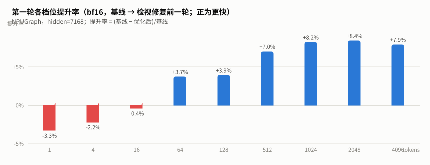
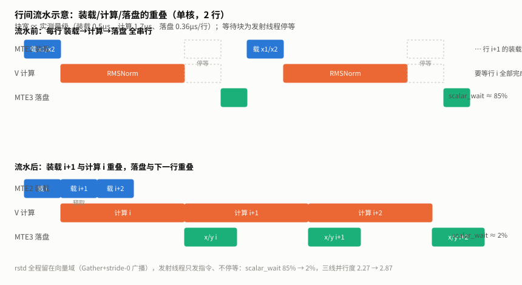
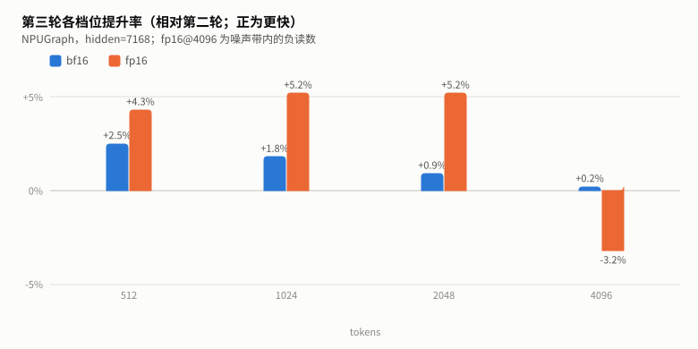
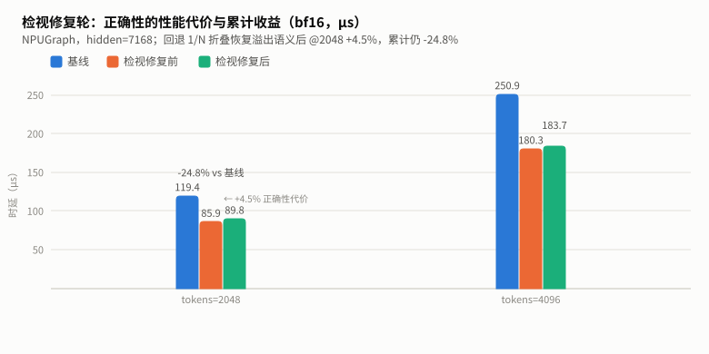
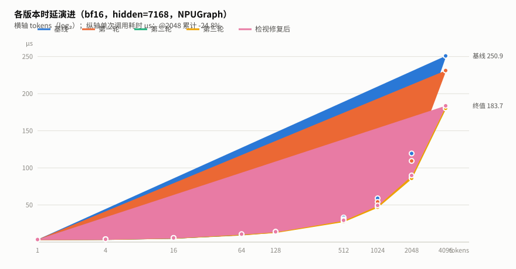

# add_rms_norm_bias 融合算子 Ascend 性能优化报告

## 1. 背景

RMSNorm 是 Transformer 每层 decoder 的必经算子；带残差连接的推理引擎里，归一化前还要先把 attention/FFN 的输出与 residual 相加。把「残差相加 → RMSNorm → bias」融为一个 kernel，可以把中间 x 的往返读写省掉，并将三次 launch 合为一次。vLLM Ascend 插件据此实现了自研算子 **`add_rms_norm_bias`**：一次调用产出三份输出（归一化结果 y、统计量 rstd、相加后的残差 x），由 `AscendRMSNorm.forward_oot` 在每层 decoder 调用，是比同族算子 rms_norm_cast 更热的生产路径。

本文档总结该算子在 Ascend 910B3 上的性能优化过程。优化在姊妹战役（rms_norm_cast，另有报告）方法论的基础上展开——事件四件套、行间双缓冲流水、Gather+stride-0 广播等范式被直接复用——并新增了三条本算子特有的经验：**先实证 tiling 变体映射再动手**、**以未动路径作噪声金丝雀**、**严格断言是性能优化的前提**。同时完整记录了一轮负结果（reduce 依赖链重构被设备实验证伪）与两条 c220 硬件实证事实。

### 测试环境

| 项目 | 值 |
|------|-----|
| 设备 | Ascend 910B3（dav_c220 向量核），40 AIV，UB 192KB/核 |
| CANN | 9.1.0 |
| 模型场景 | DeepSeek 类 hidden=7168，bf16 主 / fp16 对照 |
| 测试矩阵 | tokens = 1/4/16/64/128/512/1024/2048/4096 × bf16/fp16 |
| 计时口径 | NPUGraph capture+replay（≈背靠背 serving，5 样本取中位）；msprof op 做管线归因 |

### 算子功能

```text
x     = bf16(fp32(x1) + fp32(x2))                 # 残差相加（c220 无 bf16 元级加法，须在 fp32 域）
rstd  = 1/sqrt(mean(x²) + eps)                    # fp32
y     = bf16( fp32(bf16(x_norm)) × fp32(γ) + fp32(β) )   # 双舍入契约
返回 (y, rstd, x) 三份输出
```

---

## 2. 算子在大模型中的位置与数据

### 2.1 位置

```text
token embeddings
  → N × decoder layer（每层两次归一化，带残差时都走本算子）
       attention/FFN 输出 x1 + residual x2 → RMSNorm → bias → y
  → logits

调用方：AscendRMSNorm.forward_oot；prefill（大 tokens）与 decode（1~4 tokens）都命中
```

### 2.2 变体分发——本算子的第一课：先确认优化对象

算子按 `(dtype_key×10 + mode_key)` 分发 5 个变体（NORMAL/SPLIT_D/MERGE_N/SINGLE_N/MULTI_N）。任务简报认定「hidden=7168 走 SPLIT_D」，但静态读 tiling 推出的是另一回事，最终以设备日志实证（`ASCEND_GLOBAL_LOG_LEVEL=1` 采集 tiling 输出）：

| shape (hidden=7168) | tiling key | 变体 | 说明 |
|---|---|---|---|
| bf16, rows ≤ 40 | 33 | SINGLE_N | decode 档 |
| **bf16, rows ≥ 41** | **30** | **NORMAL** | **生产 prefill 主路径** |
| fp16, rows ≤ 40 | 13 | SINGLE_N | |
| fp16, rows ≥ 41 | 14 | MULTI_N | fp16 prefill（双缓冲、仓内"优等生"） |
| col > 11264 | *1 | SPLIT_D | **生产无此 shape**（简报误判即源于此） |

SPLIT_D 的触发条件是 `numCol > ubFactor`（有 β 时 bf16 上限 11264 列），7168 远够不着。**如果按简报直接优化 SPLIT_D，全部工作量会落在零收益的路径上。**教训：分发条件要用实测 tiling 日志钉死，不要信文档/口口相传。

### 2.3 输入输出与片上数据流

| 张量 | 形状 | 类型 | 说明 |
|---|---|---|---|
| x1 / x2 | `[tokens, 7168]` | bf16 | 输入与残差 |
| γ / β | `[7168]` | bf16 | 每核只载一次 |
| y / x | `[tokens, 7168]` | bf16 | 输出 |
| rstd | `[tokens, 1]` | fp32 | 统计量输出 |

原始实现（NORMAL 变体）**每行全串行**：单缓冲队列使下一行的 MTE2 装载必须等上一行的 V 消费完；每行末尾一次 `V_S→GetValue→S_V` 标量往返把发射线程钉在行尾。bf16 的 y 链在 fp32 域做数学（c220 无 bf16 元级乘加），每行 **15 遍全宽 pass**——其中 3 遍冗余（γ/β 的 cast 每行重做、1/N 在 reduce 前全宽乘）。

优化后的片上数据流（R2 流水化后）：

```text
每行 i（槽位 s = i&1）：
  MTE2: x1[i+1]/x2[i+1] 预取进另一槽     ← 与本行 V 链重叠
  V:    cast x1/x2 → add → rint = x_out（落 x1[s]）
        mul 平方 → reduce → 标量链(1 elem) → rstd 留在 V 域
        Gather 广播 rstd → mul → rint = y-mid → widen → ×γ → +β → rint = y（落 x2[s]）
  MTE3: x_out 与 y 落盘                  ← 与下一行 V 链重叠
  rstd: 1 elem Adds 进 8-lane 累积块 → 块末 Gather 压缩 → 一次 DataCopyPad 落 GM
```

零 `V_S/S_V` 往返；发射线程（scalar）只负责发指令，永不等待。

---

## 3. 优化总览

| 轮次 | 手段 | 针对的问题 | 参考来源 |
|---|---|---|---|
| 第一轮·减法 | 消 V_S/S_V 标量往返；γ/β cast 上提每核；1/N 折叠进标量；tiling ubFactor 11264→7168 | 15 遍全宽 pass 中 3 遍冗余 + 发射线程停等 | 代码走读 + msprof |
| 第二轮·流水 | x[2]/x2[2] 双缓冲（局部行号奇偶）、事件四件套三方向单在途、rstd 全程 V 域 | 行间零流水（单缓冲串行）、scalar_wait 85% | rms_norm_cast R2 模板 + msprof |
| 第三轮·广度 | NORMAL 序言重叠；MULTI_N 折叠 1/N；SINGLE_N 消往返 | 64-128 档序言占比、fp16/decode 路径 | 前两轮方法平移 |
| 检视修复 | 外部检视 7 条全修（UB 成本模型、rstd 压缩、溢出域、host 校验）+ 新增严格测试 | 正确性（宽松断言兜不住的行混叠/越界） | 外部检视 + 设备复现 |
| 负结果 | Reduce 依赖链重构（8 链交错） | 假设的 reduce 延迟链 | 设备实验证伪 |

**经验法则**：先实证 tiling 命中的变体（优化错变体 = 零收益）→ 消标量往返与冗余 pass（等价变换，风险最低）→ 行间流水（收益最大，风险最高，用已验证模板）→ 每步以「未动路径」作噪声金丝雀校准收益真伪 → HBM 带宽墙校准终局预期。

---

## 4. 逐轮优化过程

### 4.1 初始版本：每行全串行，双瓶颈叠加

**瓶颈判定**（msprof op，2048×7168 bf16，40 核均值，墙钟 124.4µs）：

| 指标 | 值 | 占墙钟 | 判读 |
|---|---:|---:|---|
| vec busy | 87.9µs | 73% | 最大占用者但未饱和（1.69µs/行 ÷ 15 pass ≈ 0.11µs/pass） |
| mte2 / mte3 busy | 27.0 / 18.7µs | 22% / 15% | 未与 V 充分重叠 |
| **scalar_wait** | **106.0µs** | **85%** | 发射线程几乎全程停等 |

两个信号拼出双瓶颈结构：V 是最大占用者但空转 27%；scalar_wait 85% 说明发射线程被每行的标量往返与单缓冲队列的串行点钉死——它停着，装载/落盘的重叠就无从谈起。

**代码走读量化清单**（bf16 每行 15 遍全宽 pass）：

| # | pass | 判定 |
|---|---|---|
| 1-4 | cast x1/x2 → add → rint = x 输出 | 语义必需（c220 无 bf16 元级加法） |
| 5-7 | mul 平方 → muls ×1/N → reduce 树 | muls 可折叠（#6） |
| 8-9 | 标量链 + **V_S→GetValue→S_V→SetValue** | 往返可消除（#9） |
| 10 | muls ×rstd（标量操作数） | 可改 stride-0 广播（位级一致） |
| 11-14 | rint y-mid → 重新 widen → cast γ → cast β | **γ/β cast 每行重做，可上提** |
| 15-17 | mul γ → add β → rint y 输出 | 语义必需 |

### 4.2 第一轮：消标量往返与冗余 pass

#### 问题分析

三处冗余 + 一处停等：γ/β 每核只载一次却每行 cast；1/N 在 reduce 前全宽乘；rstd 经 V_S/GetValue/S_V/SetValue 绕行标量域。每行 15 遍全宽 → 12 遍，且消掉每行 2 次跨 pipe 同步。

#### 关键变化

```cpp
// ① rstd 广播留在向量域（位级一致）：Gather 复制 sqx[0] 成 8-lane 块，
//    stride-0 块广播 Mul 替代标量操作数的 Muls——rstd 不再走 S pipe
__aicore__ inline void MulByRstd(dst, src, sqx, count) {
    Gather(rstd8, sqx, zeroOff8, 0, 8);
    PipeBarrier<PIPE_V>();
    Mul(dst, src, rstd8, 64, repeatTimes, {1, 1, 0, 8, 8, 0});   // src1RepStride=0
    ...   // 尾块同参
}

// ② γ/β 每核 widen 一次进常驻缓冲（+57.4KB，靠 tiling 收紧腾出）
// ③ 1/N 折叠：reduce 前全宽 Muls → reduce 后 1 元素 Muls
// ④ tiling：NORMAL 模式 ubFactor 11264 → numColAlign（原常量是 16B/列×11264
//    =180KB 的全宽安全设计；收紧后缓冲随 numCol 比例，为 cast 常驻腾 76KB）
```

#### 结果

NPUGraph：@2048 119.4→109.3µs（**-8.4%**），@512-4096 -7~8%；msprof wall 124.4→114.7µs、vec busy 87.9→77.8µs，mte2/mte3 不变——「纯减 vec 工作」的定位被数据确认。未动代码的 fp16 路径同轮波动 ±1µs → 该档噪声带，**收益判定以 ≥512 档为准**。



### 4.3 第二轮：行间流水（收益最大的一轮）

#### 问题分析

R1 后 vec busy 仍只占 70%、scalar_wait 84%：单缓冲队列使行 i+1 的装载等行 i 的 V 消费，发射线程被逐行钉死。**消除标量往返只是松绑，行间流水才是把 vec 喂饱的手段。**

#### 关键变化

按 rms_norm_cast R2 已验证模板重写 bf16 NORMAL（该模板自带三条避坑结论：局部行号奇偶索引、AllocEventID 四件套、退出零悬挂标志）：

```text
槽位：x1[2]/x2[2]（装载 + 兼作 x/y 输出），fp32 工作区单缓冲（仅 V 触碰，
      V 有序天然安全）；γ/β bf16 暂存借道 row-0 槽位，一次 V_MTE2 守卫释放
事件：MTE2_V（装载→V）、V_MTE2（槽位释放→装载）、MTE3_MTE2（落盘→装载）
      各单在途 + 每行一对 V_MTE3；wait 全落在消费 pipe（发射线程零阻塞）；
      发射条件与消费条件严格一致（i+2 < rowWork），退出零悬挂
rstd：全程 V 域——reduce 后 1 elem Adds 进 8-lane/行累积块（32B 对齐向量写），
      每 rowFactor 行 Gather 压缩 + 单次 DataCopyPad 落 GM
```

#### 结果

NPUGraph：@2048 109.3→**86.7µs**（**-20.7%**），@4096 -21.9%，@512 -7.8%，≤128 档持平（2-4 行/核流水不回本，属预期）。msprof：wall **86.4µs**（-30.5% vs 基线），vec busy 89.5%，**scalar_wait 106→1.86µs（85%→2%）**——发射线程完全解放，三 pipe 忙碌和/墙钟 = 1.32。

指令级流水图（本机 msprof `TimelineDetail`，前后各一份存 traces/）：

| 指标 | 流水前 | 流水后 |
|---|---:|---:|
| wall | 101.4µs | **80.7µs** |
| MTE2 忙碌 | 50.8% | **94.2%** |
| SCALAR 忙碌 | 90.0% | **2.5%** |
| 三线并行度 | 2.27 | **2.87** |



精度：126/126 一次通过（零挂死零 NaN）——模板纪律（对齐已验证实现、消费条件守卫发射、奇偶槽位）把 rms_norm_cast 首次尝试踩过的三个坑全部绕开。

### 4.4 第三轮：广度轮——序言重叠与旁支变体

三处独立小改动，一轮闭环：① NORMAL 序言里 γ/β 的 MTE2 装载提前到 iota 预计算之前（64 次 Duplicate ≈1.6µs 发射与装载重叠），64-128 档受益；② MULTI_N 折叠 1/N（fp16+bf16 共用 ComputeRstd）；③ SINGLE_N 三 dtype 消 V_S/S_V（Gather 广播，复用已死的 reduce 工作区尾块）+ 折叠。

结果：fp16 @512-2048 **-4.2~-5.3%**（MULTI_N 主收益）；bf16 decode 1-4 tokens **-2.6~-3.9%**（SINGLE_N）；bf16 大档持平（序言已摊薄）。各档收益方向与机理一一对应——「改动在哪，收益就在哪」本身就是回归验证。



### 4.5 检视修复轮：宽松断言兜不住的错误

外部静态检视 7 条，全部采纳，其中三条是**真缺陷**且两条为本轮优化引入：

| # | 问题 | 处置与教训 |
|---|---|---|
| 1 | rstd 压缩 Gather 索引按 `[b×32]×8` 生成——偏移张量**按字节逐元素**消费，n>8 时行值重复 8 份 | iota 改连续 `[0,32,...]`，**标量 SetValue** 写入（逐元素 V-store 4B 非对齐当场 fault——修复引入又当场修复）；126 用例竟全绿，因为原断言 rtol/atol=100 |
| 2 | bf16 NORMAL 缓冲随 numCol 比例增长，hidden=8192 时 UB 197KB > 192KB（原 11264 常量实为 16B/列全宽安全设计） | tiling 按 dtype/β 的**每列字节成本模型**驱动，超限回退 SPLIT_D；回退保持 colTileNum≥2（单 chunk 是 SPLIT_D 从未验证过的路径，设备实测每核一整行垃圾） |
| 3 | 1/N 后移扩大溢出域：sum(x²) 在 x≳3e17 时 Inf，golden 恒有限 | fp32/bf16 **回退折叠**（@2048 +4.5% 为正确性代价）；fp16 保留（max raw sum 5.3e13 ≪ fp32 max，有界证明入注释） |
| 4-5,7 | beta 无 shape/dtype 校验；epsilon 放过 NaN（NaN<0=false，且**调用点丢弃返回值**）；numel 无 32 位防护 | host 侧补齐；epsilon 修复要点是让返回值真正被检查 |
| 6 | 断言 rtol/atol=100 形同虚设 | **新增独立严格测试**（不动原文件）：y=3 ulp（双舍入链放大 rstd 求和顺序差异，实测最大 2 ulp）、rstd=1e-3（行间独立随机数据，行混叠必挂）、x 位级相等；补 UB 边界 col=8192、尾块 rows=313/2064/2600、无 β、epsilon/beta 拒绝路径 |

验证：原 126 + 严格 150 全绿。代价：@2048 89.8µs（85.9 → +4.5%）。**"126/126 通过"在宽松断言下不是精度证据**——严格断言先行，性能优化才有裁判。



### 4.6 负结果：Reduce 依赖链重构被设备证伪

**假设**：legacy 归约的单指令多 repeat `Add(..., dstRepStride=0)` 在同一累加块上形成 112 深 RAW 链，顺序 V 管线应完整暴露该延迟（估 0.3-0.6µs/行）；8 链交错发射可消除。

**实验**（8×64-float 累加器、交错发射、显式两两折叠；仅切换流水化 bf16 路径）：

| 实验 | 结果 |
|---|---|
| 交错发射，累加器在 src1（dst==src1） | **vector core exception**（col=7168 无尾也崩） |
| 链主体顺序发射（其余同上） | 通过 → 故障定位于交错本身 |
| 交错发射，累加器在 **src0**（dst==src0） | 通过 → 可用形式 |
| 最终版（150 严格 + 126 全绿） | @2048 89.09 vs 89.81µs（**-0.8%，噪声级**）；vec busy 77.4µs = 加回 avgFactor pass 后的预期值，分毫未降 |

**两条 c220 硬件实证事实**（比收益本身更有价值）：

1. **单指令多 repeat 的累加（dstRepStride=0）硬件内部按吞吐执行，不暴露 repeat 间依赖延迟**——"拆依赖链"这类经典 CPU 直觉在该指令形态上零收益；静态分析发现的 0.44µs/行"未解释缺口"应归属 cast 半吞吐等因素。
2. **交错发射的单 repeat `Add`，dst 轮转且 dst==src1 时触发 vector core exception；累加器放 src0 位（dst==src0）则安全**。顺序发射时 dst==src1 无恙。

已回退（112 条标量发射/行 vs legacy 1 条，issue 侧反而更重）。负结果与其机理一并留档，避免未来重复推导。

### 4.7 总收益与最终状态

**累计优化（NPUGraph，hidden=7168，µs）**：

| 版本 | @512 | @1024 | @2048 | @4096 |
|---|---:|---:|---:|---:|
| 基线 | 33.2 | 59.0 | 119.4 | 250.9 |
| + 第一轮（消往返/冗余 pass） | 30.8 | 54.2 | 109.3 | 231.1 |
| + 第二轮（行间流水） | 28.4 | 47.9 | 86.7 | 180.6 |
| + 第三轮（广度） | 27.7 | 47.1 | 85.9 | 180.3 |
| + 检视修复（溢出域回退） | **29.4** | **49.5** | **89.8** | **183.7** |
| **累计** | **-11.4%** | **-16.2%** | **-24.8%** | **-26.8%** |



fp16（MULTI_N 折叠保留）：@2048 63.0→60.4µs（-4.1%）。vs unfused ref：bf16 @2048 快 29%（基线仅快 6.5%）。

**最终状态**（msprof，2048×7168 bf16，40 核均值，墙钟 89.4µs）：vec busy 89.3%、scalar_wait 2%、MTE2/MTE3 全部隐藏（三线并行度 2.87）；搬运 117MB ≈ 1.36TB/s，**已达 HBM 峰值带宽的 ~85%**——理论地板 ~73µs，V 侧进一步优化被带宽墙截胡，收益空间收敛到 decode 预取等 issue/延迟方向。

---

## 5. 归因速查表与关键经验

### 5.1 归因速查表

（本项目实际走过的归因路径；"看什么"是 msprof 字段、tiling 日志或代码检视点）

| 症状 / 问题 | 看什么 | 本例读数 → 结论 |
|---|---|---|
| 不确定优化对象是否命中 | `ASCEND_GLOBAL_LOG_LEVEL=1` 采 tiling 日志的 key/ub_factor | 简报说 SPLIT_D，实测 key 30=NORMAL → 重定优化对象 |
| scalar_wait 占比异常高 | `aiv_scalar_wait_time / wall` | 85% → 发射线程被标量往返+单缓冲串行钉死，先消往返再行间流水 |
| vec busy 不饱和 + scalar_wait 高 | 双指标并列读 | 73% + 85% → 双瓶颈：减 pass 与流水都要做，顺序是先减（等价）后流水（重构） |
| 收益是真还是噪声 | **未动路径作金丝雀**，同轮对照 | fp16（未动）波动 ±1µs/±10% → bf16 的 -8.4%/-20.7% 判真，128 档 ±1.2µs 判噪声 |
| 数字看着对但不敢信 | 断言强度审计 | rtol=100 形同虚设 → rstd 行混叠（压缩 bug）漏网；分级严格断言（y=3ulp/rstd=1e-3/x 位级）是前提 |
| 大 shape 收益到顶了？ | 搬运字节 ÷ 墙钟 vs HBM 峰值 | 117MB/89.4µs = 1.36TB/s ≈ 85% 峰值 → 剩余空间 ~15%，V 侧优化被带宽墙截胡 |
| "合理"的优化上板无效 | 不纠结理论，直接测 | reduce 拆链 vec busy 分毫未降 → 硬件内部已按吞吐执行，负结果留档 |
| 测试结果离奇（超时/崩溃） | `/proc/loadavg`、设备日志 | 共享宿主 loadavg 200+（192 核）→ CPU 饥饿，结果不可信，先排环境 |

### 5.2 关键经验

1. **先实证分发，再动手**：多变体算子的第一件事是用 tiling 日志钉死每个生产 shape 命中的变体与参数（key、ub_factor、block_factor）。本例简报的变体归属是错的——按简报优化将获得精确的零收益；
2. **发射线程的停等是最优先消除项**：`V_S` 是唯一阻塞发射线程的跨 pipe 等待；scalar_wait 占比是它的直接读数。消除标量往返（Gather+stride-0 广播、rstd 全程 V 域）比削减 V 指令更先做——发射线程解放后，流水与减 pass 的收益才兑现；
3. **bf16 的 pass 下限先算清**：c220 无 bf16 元级乘加 → 所有数学在 fp32 域，加宽/舍入/再宽都是语义必需。可削减的只有"重复计算"（每行重做的 cast、reduce 前的全宽 1/N）；把语义 pass 数数清楚，才知道优化空间还剩多少；
4. **未动路径是天然噪声金丝雀**：同轮测量中代码未变的路径波动多少，噪声带就是多少——中小 shape 的收益真伪全靠它裁决（±10% 波动与 -8.4% 收益的判别实例）；
5. **严格断言是性能优化的前提**：rtol/atol=100 的测试下"126 全绿"不含信息量。y/rstd/x 分级容差（3 ulp / 1e-3 / 位级）+ 行间独立随机数据 + 尾块/边界 shape，才能让"全绿"重新成为精度证据；rstd 行混叠这类错误 y 都会带偏，但幅度恰在宽松容差内；
6. **UB 预算与 tiling 必须成本模型化**：常量 ubFactor 往往是"按最坏列宽 × 每列字节"的全宽安全设计；一旦按 numCol 收紧，缓冲总量就随 shape 比例增长——host 侧必须按 dtype/β 的每列成本 + 固定开销核算，超限回退到已验证路径（并保证回退配置本身落在被验证过的参数域内——本例 colTileNum=1 即回退引入的新雷）；
7. **溢出域也是契约**：数学等价变换要区分"舍入路径 ~1ulp"与"溢出域改变"两类——前者可接受（golden 自身求和顺序也不同），后者必须回退或有界证明（fp16 的 max raw sum 可静态证明远离 fp32 上限，故折叠保留）；
8. **硬件行为要实验裁定，直觉会让路**：reduce 依赖链重构是教科书式优化，上板零收益（多 repeat 累加硬件内部按吞吐执行）；而"acc 在 src1 位的交错累加会 fault、放 src0 安全"这种文档没有的雷，只有设备实验能暴露。负结果与其机理同样留档；
9. **环境先于归因**：共享宿主机 loadavg 飙到 200+ 时，测试超时、vector core 异常、离谱波动都可能是 CPU 饥饿的产物——`/proc/loadavg` 一条命令先排除环境，再怀疑 kernel。
