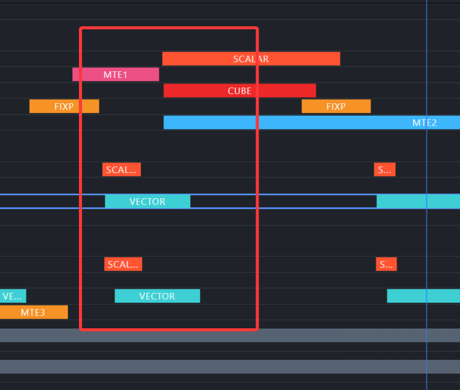
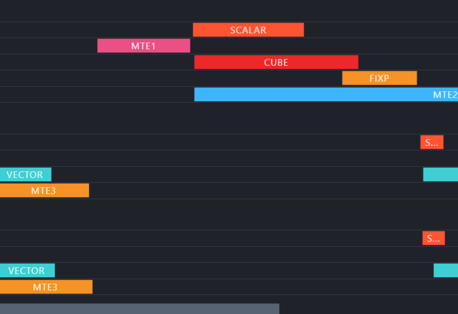

# Attention 融合算子 Ascend 性能优化报告（attn_rel_h_rel_w）

## 1. 背景

Attention 是 Transformer 架构的计算核心：大模型推理的主要算力消耗在 attention 与 FFN 的矩阵乘上，而 attention 的中间 score/probability 矩阵规模随序列长度平方增长，使其成为推理引擎中最值得优化的热点算子。为避免完整的 score/probability 反复读写显存，现代推理框架普遍采用 **FlashAttention 形式的融合实现**——K/V 分块流入片上、softmax 在线归约、概率块不落 GM。在 Ascend 这类 Cube/Vector 异构架构上，attention 进一步实现为 **Cube/Vector 混合核**：两次 GEMM 在 AIC 的 Cube 执行，scale/bias/softmax/rescale 在 AIV 的 Vector 执行，性能由两条管线的衔接质量决定。

本文档以 tilelang-deepseek 框架在 Ascend 平台上的 Attention 融合算子为对象，总结其性能优化过程。主体案例为 **`attn_rel_h_rel_w`**——DeepSeek-OCR 视觉编码器中的注意力算子，在标准 FlashAttention 之外叠加 REL_H/REL_W 二维查表偏置。全文的优化经验围绕四条主线展开：修正项按数据依赖分类外提、生产者直写消费者布局、流水深度按 shape 实测、用生成代码校准成本模型。

### 测试环境

| 项目 | 值 |
|------|-----|
| 设备 | Ascend950DT_9592（V120），36 AIC / 72 AIV，满频 1650/1650 MHz |
| CANN | 9.1.0 |
| TileLang | tilelang-deepseek |
| 测试矩阵 | `(batch, side) = (2,14)/(1,40)/(1,64)`，`heads=12`，`D=64` |
| 序列长度 | S = side² = 196 / 1600 / 4096 |
| 数据类型 | bfloat16 输入，FP32 累加，概率 BF16 |

### 算子功能

`attn_rel_h_rel_w`：对每个 `(batch, head)` 的查询块计算 score = QKᵀ/sqrt(D) → 叠加二维分解式相对位置偏置（key 下标映射为 `(j//side, j%side)`，从 REL_H/REL_W 两张表取数相加）→ 在线 softmax → 加权求和 PV → 除以行和、转 BF16 写回。

```text
score[i,j] = Q[i]·K[j]/sqrt(D) + REL_H[i, j//side] + REL_W[i, j%side]
P = online_softmax(score)        # 前向，无 mask/dropout
O = P @ V
```

---

## 2. Attention 融合算子在大模型中的位置与数据

### 2.1 位置

```text
文档图像 → patch embedding → ViT 视觉编码器（N 个 block）→ 语言模型

每个 ViT block 的注意力（四段融合为一个混合核）：
  QKᵀ → +REL_H/+REL_W 查表 → online softmax → PV

Ascend 实现：1 AIC（Cube）+ 2 AIV（Vector）协作 / task
```

它是典型的 **Cube/Vector 混合核**：QKᵀ 与 PV 两次 GEMM 在 AIC 的 Cube 上执行，scale、查表偏置、在线 softmax、rescale 在 AIV 的 Vector 上执行，中间经 L0C→UB→L1 多级交接。优化对象是"两条管线的衔接"，而非任何单条管线。

### 2.2 输入输出张量

| 张量 | 形状 | 数据类型 | 说明 |
|---|---|---|---|
| Q / K / V | `[batch, seq_len, heads, dim]` | bf16 | 实现按 BSHD 布局传入 |
| REL_H / REL_W | `[batch, seq_len, heads, w_aligned]`，`w_aligned = ceil(side/8)*8` | bf16 | task 序幕一次性进 UB，整个 key 循环复用 |
| Output | `[batch, seq_len, heads, dim]` | bf16 | FP32 累加归一化后转 bf16 写回 |

### 2.3 数据特点与片上数据流

- **计算密集**：两次 `S×S×D` GEMM 主导，但 Vector 侧的 softmax 指令链同样可观；
- **查表偏置**：score 修正项是两次表查询（`j//side`、`j%side`），寻址方式随 `side` 与向量宽度的整除关系改变——这孕育了本算子最重要的算法级优化（§6.1）；
- **在线归约**：softmax 以行内在线方式逐 key 块归约（max/sum/O_acc 三状态递推），概率块只在片上存活、不落 GM——中间布局（ND vs NZ）直接决定 Vector 与 Cube 能否直连（§6.2）。

优化后形态的完整片上数据流（与原始实现的差异见 §4.1）：

```text
Q GM ──copy──> Q L1（task 生命周期内常驻）
K/V block GM ──copy──> K/V L1（随 key block 流式搬入）

Q L1 × K L1
      │
      ▼
QK Cube（AIC，结果位于 L0C）
      │ dual_copy
      ▼
两路 AIV 的 score UB
      │ + REL_H / REL_W（两张偏置表按 task 常驻 UB）
      │ online softmax
      ▼
BF16 compact NZ（UB）
      │ dual_copy
      ▼
P L1 × V L1
      │
      ▼
PV Cube（AIC，L0C）
      │ dual_copy
      ▼
AIV UB：FP32 重标度累加、最终归一化
      │
      ▼
Output GM
```

注意：完整的 P 矩阵不会落入 GM——每个概率块仅在片上参与当前 key 块的 PV 计算。

---

## 3. 优化总览

| 优化类别 | 本算子的手段 | 适用前提 | 参考来源 |
|---|---|---|---|
| 常规·瓶颈侧 | key-only 索引外提、连续 bias 路径、compact softmax 直写 NZ | 生成代码检视发现冗余/中转 | profiling + kernel source |
| 常规·流水侧 | `T.serial`→`T.Pipelined`、按 key 块数分派 2/3-stage | C/V 交接空档 | PipeTimeline |
| 非常规·算法侧 | 整除性路径分派、NZ 直写、latency hint 校准成本模型 | 数据语义/布局/调度模型的特殊性质 | 代码分析 + trace |

**经验法则**：Attention 混合核先看 C/V 衔接（数据流冗余 → 流水 → 成本模型，按此顺序），再考虑指令级手段；指令削减只有在 Vector 成为关键路径后才可能变现。

---

## 4. 信息收集

### 4.1 分析瓶颈（profiling 数据）

**原始实现基线**（msprof，`be78b30d` 批次）：

| 指标 | S=196 | S=1600 | S=4096 |
|---|---:|---:|---:|
| TaskDuration | 33.2 us | 469.2 us | 2514.7 us |
| AIV vec_ratio | 0.769 | 0.870 | 0.878 |
| AIC mad / mte2 | 0.051 / 0.147 | 0.058 / 0.112 | 0.059 / 0.070 |

**生成代码检视**（`get_kernel_source()` 逐段清点，S=4096 实例）：

- 每 key 块每 AIV 向量指令 4294 条：bias 2438 / softmax 1344 / ND→NZ 重排 128 / rescale 384；
- bias 段 19 条指令中 **9 条 key-only 指令在 64 行 query 循环内逐行重算**（每 key 块每 AIV 重复执行 128 次；编译器在手写 SIMD scope 内不做外提），其中 int16 `vdiv` 为微码除法、单条代价远高于常规向量指令；
- 概率按 ND 写出后再做 ND→NZ 重排（128 条指令 + 16 KB staging）；
- key 循环用 `T.serial`，Cube 与 Vector 交接完全串行。

**瓶颈判定**：瓶颈不在单条管线，而在三处叠加——修正分支的冗余计算（索引逐行重算）、概率路径的布局中转（ND 写出再转 NZ）、缺失的软件流水。另有一类要到后期才暴露的问题：自动调度成本模型对个别 scope 的低估（§6.3）。

**归因速查表**（本项目实际走过的归因路径，换一个算子时按症状索引比按结论记忆更有用；"看什么"是 msprof 字段或生成代码检视点）：

| 症状 / 问题 | 看什么 | 本例读数 → 结论 |
|---|---|---|
| 时延高，不知卡在哪 | AIV/AIC 各 pipe ratio，再用关键核 trace 看单核占空 | S=4096 vec 96.6%（72 核均值）/ 97.1%（关键核）→ Vector 主导 |
| 主导 pipe 已占满，还有空间吗 | 关键核 trace 的空隙 | 空隙 2.6%（7.4 us）→ 填空隙收益有限，转向减指令、重组数据流 |
| 时延下降但 vec_ratio 也降 | 时延 × vec_ratio 对照 + 生成 schedule 对照 | 0.878 → 0.812：Vector 冗余减少、关键路径转向核间交接 → 加深流水（3-stage 后 0.968） |
| 怀疑核内重叠不足 | AIV 四管之和（vec+scalar+mte2+mte3 ratio 相加） | 之和 <100% 说明串行+空转（S=196 为 79%）；明显 >100% 说明真重叠（S=4096 为 152%） |
| 核间忙闲不均 | aiv_time 的 min/avg/max spread | 7.5→13.4 us（77%）→ 核间负载不均/并行度受限，先对照负载不均占比再谈结构重构 |
| 搬运占比高 | mte2_ratio × 带宽占用 × 平均传输粒度 | 63.9% 高而带宽占用仅 3.6%、平均传输仅 0.41 KB → burst 结构问题，非带宽饱和 |

注意口径：同一份采集中"72 核均值 ratio"与"关键核 trace 占空"不是同一统计量，对照时保持口径一致。

### 4.2 查看掩盖关系（流水图）

**原始实现**：`T.serial` key 循环下每个 key 块依次经历「K/V 搬入 → QK Cube → bias+softmax → PV Cube → rescale」，Cube 与 Vector 交接串行、互不掩盖。

**第一轮重构后**：数据流冗余消除使 S=4096 总时延大幅下降，但 vec_ratio 从 0.878 **降到 0.812**——结合总时延与生成调度对照，说明冗余 Vector 工作减少、关键路径转向核间交接与调度空档。

**第二轮 3-stage 后**：S=4096 vec_ratio 从 0.812 **提升到 0.968**，MTE2/MTE3 被流水有效 overlap。最终版本单核组（core0：1 AIC + 2 AIV）的整 kernel 管线统计（PipeTimeline trace.json，S=4096，墙钟 289.8 us）：

| 核 | 管线 | 事件数 | 忙碌 | 占墙钟 |
|---|---|---:|---:|---:|
| AIC | CUBE | 704 | 165.1 us | 57.0% |
| AIC | MTE1 | 704 | 87.8 us | 30.3% |
| AIC | MTE2 | 606 | 150.1 us | 51.8% |
| AIC | FIXP | 386 | 170.9 us | 59.0% |
| AIV0 | VECTOR | **36** | **278.0 us** | **95.9%** |
| AIV0 | MTE3 | 363 | 128.9 us | 44.5% |
| AIV1 | VECTOR | 36 | 277.7 us | 95.8% |

两个信号：AIC 四条管线各占墙钟 30～59% 且互相重叠（总和远超 100%）；AIV 的 VECTOR 只有 36 个事件却忙碌 95.9%——**长连续段、几乎无空档**，说明 key 块之间的交接已被流水藏住。

**3-stage 与 2-stage 的直接对照**（同机同批采集，代码相同、仅 stage 数不同；MindStudio 打开 trace.json 的单核组视图）：





3-stage 版本 Task Duration 287.9 us，2-stage 版本 346.7 us（**3-stage 快 17.0%**）。第一张图中 CUBE 与两个 AIV 的 VECTOR 深度交错；第二张图中 Cube 批次更稀疏、AIV 侧等待区间更长——时延差来自 C/V 并行度提升，而非单条管线提速。

---

## 5. 针对性的有效优化点

优化分三轮推进：原始实现 → **结构性重构**（§5.1 + 2-stage）→ **按 shape 分派流水深度**（§5.2）→ **latency hint 校准成本模型**（§6.3）。所有收益以正数（加速倍数 / 提升 %）表示。

### 5.1 针对瓶颈的优化（消除数据流冗余）

#### 优化 1：key-only 索引外提（收益并入第一轮整体）

**思路**：bias 段 9 条只依赖 key 列的索引指令（`vci/vshrs/vcmps/vsel/vdiv/vmul/vsub`）被放在 64 行 query 循环内逐行重算。按数据依赖分类：只依赖 key 的提出行循环外（每向量算一次），只依赖 query 的提出 key 循环外。

```python
# 修改前：索引在行循环内，64 行 × 每行重算
with T.SimdVF():
    for i in range(rows_per_aiv):            # 64 行
        for vector_id in range(block_N // vector_lanes):
            rel_h_index = T.simd.vdiv(safe_key_indices_b16, side_vec, gather_mask)  # ← 每行重算
            rel_w_index = T.simd.vsub(...)
            rel_h_vec = T.simd.vcvt(T.simd.vgather2(rel_h_ub[i, 0], rel_h_index, ...))

# 修改后：索引提到向量层（每向量一次），行循环内只做加载
with T.SimdVF():
    if not use_contiguous_rel_bias:
        ...  # 循环不变常量：gather mask、side_vec、-inf
    for vector_id in range(block_N // vector_lanes):
        if not use_contiguous_rel_bias:
            ...  # key-only 索引（vci/vdiv/vmul/vsub → rel_h_index/rel_w_index），每向量一次
        for i in range(rows_per_aiv):
            rel_h_vec = T.simd.vcvt(T.simd.vgather2(rel_h_ub[i, 0], rel_h_index, ...))
```

**依赖判据与指令账**：`rel_h_index/rel_w_index` 只由 `key_start` 决定（key 侧），与 query 行 `i` 无关 → 提出行循环；`rel_h_vec/rel_w_vec`、`scaled_score` 逐行不同 → 留在行内。gather 路径下这一改动的指令账：9 条索引指令从每 key 块 64 行 × 2 向量 = 128 次重算（1152 条）降为每向量 1 次（18 条）；其中 `vdiv` 为微码除法、单条代价远高于常规向量指令。

#### 优化 2：连续 bias 路径（`side % 64 == 0` 专属，原理见 §6.1）

```python
use_contiguous_rel_bias = side % vector_lanes == 0   # side=64 专属；⇒ seq_len%128==0 ⇒ 无尾块

for vector_id in range(block_N // vector_lanes):
    ...
    for i in range(rows_per_aiv):
        if use_contiguous_rel_bias:
            # 免索引计算、免 gather、免尾块掩码
            rel_h_vec = T.simd.vcvt(T.simd.vld(rel_h_ub[i, rel_offset // side], 'BRC_B16'))   # 广播读
            rel_w_vec = T.simd.vcvt(T.simd.vld(rel_w_ub[i, rel_offset % side], 'UNPK_B16'))   # 连续读
        else:
            rel_h_vec = T.simd.vcvt(T.simd.vgather2(rel_h_ub[i, 0], rel_h_index, ...))        # gather + 掩码
```

**两种读模式的含义**：`side % 64 == 0` 时 64 个连续 key 恰好铺满 REL_H 的一行——同一向量内行坐标 `j // side` 恒定，`BRC_B16` 广播读把同一个 bf16 元素灌满 64 lane；列坐标 `j % side` 恰为 0..63 连续，`UNPK_B16` 一次连续解包读出。相比 gather 路径，每向量省 9 条索引指令、2 条 `vgather2` 与尾块 `-inf` 掩码；`seq_len % 128 == 0` 由整除关系保证无尾块。`side=40`（S=1600）不满足整除，仍走 gather。

#### 优化 3：compact softmax 直写 NZ（key 块数 ≥13 启用，原理见 §6.2）

```python
# ① even/odd 各转 bf16：part=0/1 把 fp32 概率转出的 bf16 分别放进 32-bit lane 的低/高 16 位
even_bf16 = T.simd.vcvt(prob_even, 'bfloat16', softmax_full, sat=False, part=0)
odd_bf16  = T.simd.vcvt(prob_odd,  'bfloat16', softmax_full, sat=False, part=1)
# ② 位合并：两半边互补为零，按 uint16 OR 后拼成 NZ 需要的交错 bf16 对
merged_bits = T.simd.vor(T.reinterpret(even_bf16, 'uint16x128'),
                         T.reinterpret(odd_bf16,  'uint16x128'), softmax_b16)
# ③ 散写：一条指令把 128 个 bf16 按 NZ stride 写进 p_nz_ub，等价于寄存器内完成 ND→NZ
T.simd.vsstb(T.reinterpret(merged_bits, 'bfloat16x128'),
             p_nz_ub[row, 0], T.int32((rows_per_aiv + 1) << 16), softmax_b16)
...
T.simd.mem_bar('VST_VLD')
```

**机制**：NZ 的块内交错结构恰好等于偶/奇元素交错——`vcvt(part=0/1)` 让偶位元素的 bf16 落在 32-bit lane 低半、奇位落在高半（另一半为 0），一条 `vor` 按位拼合，`vsstb` 按 NZ stride 散写落盘。`p_nz_ub` 按该布局摆放并多分一行（对齐拷贝粒度），`make_ascend_compact_nz_layout` 注解使 UB→L1 的 `dual_copy` 退化为纯连续搬运——原路径 ND→NZ 重排的 128 条指令与 16 KB staging 全部消失。**代价**：softmax 由单遍在线变为两遍扫描（第一遍求本块 row-max 并与历史 max 合并，`mem_bar` 后第二遍 exp/写盘/求和），块数少时摊不回来——`key_block_count ≥ 13` 的分派阈值由此而来。

**第一轮整体效果**（三项叠加 + 软件流水，msprof）：

| 指标 | S=196 | S=1600 | S=4096 |
|---|---:|---:|---:|
| TaskDuration（旧 → 新） | 33.2 → 14.1 | 469.2 → 103.3 | 2514.7 → 346.7 |
| 加速倍数 | **×2.35** | **×4.54** | **×7.25** |
| AIV vec（旧 → 新） | 0.769 → 0.465 | 0.870 → 0.765 | 0.878 → 0.812 |

### 5.2 针对流水的优化

#### 优化 4：key 循环 `T.serial` → `T.Pipelined`，按 key 块数分派 2/3-stage

```python
PIPELINE_3STAGE_MIN_KEY_BLOCKS = 13
COMPACT_NZ_MIN_KEY_BLOCKS = 13

def _pipeline_stages(seq_len: int) -> int:
    return 3 if _key_block_count(seq_len) >= PIPELINE_3STAGE_MIN_KEY_BLOCKS else 2

for key_block in T.Pipelined(key_blocks, num_stages=pipeline_stages,
                             annotations={"enable_offset": True}):
    ...   # 循环体不变
```

**效果**（msprof）：S=1600 2→3-stage 103.3 → 89.5 us（**提升 13.4%**，加速 ×1.15）；S=4096 346.7 → 287.9 us（**提升 17.0%**，加速 ×1.20）；S=4096 vec_ratio 0.812 → 0.968。S=196 在第一轮重构后仍是 `num_stages=1` 全串行（仅 2 个 key 块），补开 2-stage：14.1 → 13.3 us（提升 5.7%）——短循环也能从双缓冲受益。

### 5.3 优化效果对比，总收益

**累计优化（A/B 逐步叠加）**：

| 版本 | S=196 | S=1600 | S=4096 | 累计加速（196/1600/4096） |
|---|---:|---:|---:|---|
| 原始实现 | 33.2 us | 469.2 us | 2514.7 us | — |
| + 第一轮结构性重构（§5.1 + 2-stage） | 14.1 us | 103.3 us | 346.7 us | ×2.35 / ×4.54 / ×7.25 |
| + 第二轮流水深度分派（§5.2） | 13.3 us | 89.5 us | 287.9 us | ×2.49 / ×5.24 / ×8.74 |
| + 第三轮 latency hint（§6.3） | **12.1 us** | 89.5 us | **287.5 us** | **×2.74 / ×5.24 / ×8.75** |


收益结构：第一轮消除数据流冗余，贡献累计加速的大头；第二、三轮分别针对调度空档与成本模型，在第一轮基础上再提升 14.2%/13.4%/17.1%——三轮解决的是性质不同的瓶颈。

**优化后的效果**（最终版本，72 AIV / 36 AIC 均值）：

| 指标 | S=196 | S=1600 | S=4096 |
|------|-------|--------|--------|
| TaskDuration | 12.1 us | 89.5 us | 287.5 us |
| AIV vec_ratio | 46.2% | 87.5% | **96.6%** |
| AIC mte2_ratio | 30.6% | **63.9%** | 60.3% |
| AIC fixpipe_ratio | 8.5% | 49.4% | 59.1% |
| 核间 aiv_time spread | 7.5→13.4 us | 71→89 us | 259→287 us |

- **S=4096：Vector 主导。** 关键核 Vector 忙碌约 97.1%、空隙仅 7.4 us（2.6%）；GM→L1 流量 399 MB、带宽占用 6.9%——时延由 Vector 指令吞吐决定，访存不构成约束。
- **S=1600：MTE2 占比最高。** mte2 63.9%、AIV read_hit 35%～49%，L2 hint 与 group_size A/B 均未获益——时延瓶颈在 128B strided burst 的访问结构（平均传输粒度 0.41 KB），而非带宽饱和（带宽占用仅 3.6%）。
- **S=196：固定同步开销与核间负载不均主导。** vec 仅 46%、核间负载不均（最快核 7.5 µs、最慢核 13.4 µs，48 task 分不均 36 组所致）、头开销 0.4%～4.8%——小 shape 的时延下限由这两项决定。

---

## 6. 非常规优化：算法级路径分派

常规优化做的是工程手段（外提、流水、缓冲）；当优化空间藏在**数据语义、布局与调度模型的特殊性质**上时，需要回到算子本身找——这是本节三个优化"非常规"的原因，每条均附适用条件。

### 6.1 整除性路径分派：为什么 `side % 64 == 0` 可以免 gather

一个 64-lane 向量每次处理 64 个连续 key。REL_H 取 `j // side`（行坐标），REL_W 取 `j % side`（列坐标），两种取数模式由整除关系决定：

| 场景 | 分组 | 行坐标 j//side | 列坐标 j%side | 取数方式 |
|---|---|---|---|---|
| side=64（S=4096）：64 个连续 key 恰好铺满一行 | 向量 0（key 0..63） | 恒为 0 | 0..63 连续 | REL_H 广播读（BRC_B16）+ REL_W 连续读（UNPK_B16） |
| | 向量 1（key 64..127） | 恒为 1 | 0..63 连续 | 同上 |
| side=40（S=1600）：64 个连续 key 跨多行 | 向量内 lane 0..39（key 0..39） | 0 | 0..39 | 逐 lane 算 (行,列) 索引（vdiv/vmul/vsub）后 gather（vgather2），尾块加 -inf 掩码 |
| | 向量内 lane 40..63（key 40..63） | 1 | 0..23（中途回卷） | 同上 |

原始实现里，即使 `side=64` 也走 gather 路径。此时 64 个 lane 的取数地址本是最规律的模式——REL_H 各 lane 同址（行坐标恒定）、REL_W 逐 lane 连续（0..63）——广播读/连续读即可覆盖；而 gather 是逐 lane 独立取址的慢路径，在这里属于退化使用。三重冗余同时成立：索引指令算出的是"恒定 + 0..63"的平凡序列；gather 承担了广播/连续读就能完成的工作；rel_w 对相邻向量是同一份结果，却各自重查。`side % 64 == 0` 的识别让编译期分派掉这一切——条件成立时，生成的指令流里只剩一条广播读（`BRC_B16`）与一条连续读（`UNPK_B16`），索引指令、gather、尾块掩码根本不存在。背后的通用原则：**不规则索引尽量前置到可向量化的阶段批量处理**；整除关系成立时更进一步——地址模式本身就是索引，连索引计算都可以消掉。

**适用条件**：查表偏置的行/列坐标周期与 SIMD 向量宽度成整除关系，且偏置表按行存储。
**不适用**：`side` 非向量宽度倍数（本例 side=40 只能 gather）；ALiBi 等连续函数偏置无需查表，直接算即可。

### 6.2 布局直连：为什么 compact softmax 可以直写 NZ

第二 GEMM（PV）要求 P 以 NZ（分块转置）布局进入 L1。原路径先按 ND（逐行）写 UB，再由拷贝做 ND→NZ 重排；compact 路径让 Vector **直接生产 NZ**：

| 步骤 | 原路径（ND 中转） | compact 路径（直写 NZ） |
|---|---|---|
| 概率写出 | vcvt 转 bf16，vsts 按 ND 写 prob_ub | vcvt(even, part=0) + vcvt(odd, part=1)，vor 按位合并成 bf16 对 |
| 布局转换 | dual_copy 内 ND→NZ 重排（128 条指令 + 16 KB staging） | vsstb 按 NZ stride 直接落盘（寄存器内完成 ND→NZ） |
| UB→L1 | 重排后拷贝进 p_l1 | make_ascend_compact_nz_layout 使拷贝纯连续 |

关键洞察是 **生产者直写消费者布局**：NZ 的交错结构恰好可以用"even/odd 两个 vcvt part + 一条 vor"在寄存器内完成，`vsstb` 的 scatter-store 直接按 NZ stride 落盘，中间布局与重排指令全部消失。

**适用条件**：消费者布局可以被寄存器级操作（cast part + 位合并 + scatter store）直接表达；概率块仅在片上存活（不落 GM）。
**不适用**：布局转换需要跨行数据重排（寄存器内无法完成）；key 块数过少时两遍扫描的额外行缓冲摊不回来（本算子以 `key_block_count ≥ 13` 为分派阈值，短序列保留 ordinary 单遍路径）。
**收益边界**：省 128 条重排指令 + 16 KB staging/块；在大 shape（Vector 饱和）时收益最大。

### 6.3 调度模型校准：为什么 latency hint 是"改模型"而不是"改硬件"

`T.SimdVF(latency=N)` 是向自动调度成本模型补充信息的接口：编译器的 op-count 估计对某些 scope（本例 ordinary softmax，~1344 条 SIMD ops）系统性偏低，导致调度器给出的重叠预算不足。hint 把该 scope 的代价估计拉到合理量级，调度器据此重排 stage 结构——**指令体一条不变，变的只有生成调度**。

```python
@T.macro
def ordinary_softmax(score_ub, prob_ub, max_ub, sum_ub, alpha_ub):
    # Auto-scheduler latency hint (tl.vf_latency)：~1344 条 SIMD ops / key 块，
    # 按参考 flash-attention 的保守 ~1.41 ops/cycle 折算（其 softmax ~1041 ops → 735 cycles），
    # 即 1344 / 1.41 ≈ 948。
    with T.SimdVF(latency=948):
        ...   # 原有 softmax 指令体逐条不变
```

**效果**（`13096266` 批次，4 次独立复测）：提示前中位数 13.3 us，提示后中位数 **12.1 us**（**提升 9.0%**）。948 始终是**候选延迟估计**，不是实测等待时延。

**适用条件**：指令体不变、调度类参数却带来超出噪声的波动；有生成代码与 Profile 支持的模型偏差假设；hint 值来源（估算/实测）可记录。
**不适用**：瓶颈在数据流冗余或搬运时（先做 §5.1）；把提示扩散到非瓶颈 scope。
**收益边界**：本例提升 9.0%（S=196）。

---

## 7. 关键经验

1. **先看 C/V 衔接，再谈单管线**：混合核的瓶颈往往是"两条管线的交接"而非某条管线本身——原始实现 Vector 被高价索引指令占据，第一轮消除冗余后 vec_ratio 反而下降（0.878→0.812），说明关键路径转移到了交接空档；3-stage 把空档吸干（0.968）才兑现全部收益。时延 × vec_ratio 的交叉解读是本类算子最重要的诊断动作；
2. **数据依赖分类是修正分支优化的第一步**：只依赖 key 的计算提出行循环外、只依赖 query 的提出 key 循环外；手写 SIMD scope 内编译器不做外提，必须检查生成代码确认；
3. **生产者直写消费者布局**：softmax 输出布局由第二 GEMM 的输入布局倒推——中间布局（ND）与重排指令（ND→NZ）是可以被"寄存器内直接合成目标布局"整体消灭的，前提是转换能用 cast part + 位合并 + scatter store 表达；
4. **流水深度是逐 case 实测的编译期参数**：3-stage 提升两成；按 key 块数分派，每条路径有明确覆盖 case 与实测阈值；短循环（2 块）也能从 2-stage 受益；
5. **编译器注解必须验证三件事**：lowering 是否消费、生成代码是否产生预期 buffer version、上板时延是否变化；本例 `multi_buffer_eligible` 被调度器忽略、外层裸 `num_stages` 生成代码逐行未变，`annotate_buffer_versions` 在嵌套流水下版本膨胀，显式版本化 buffer 上的 `T.fill` 触发 lowering 断言（版本相关观察，非语言层面普遍结论）——"写了注解"不等于"优化完成"；
6. **成本模型校准是"改调度"不是"改硬件"**：latency hint 修的是调度器对 scope 代价的低估；指令体不变而生成 schedule 变（scope 合并后 vec 0.968→0.788 即此类），说明收益来自调度而非指令——一次只标一个经 Profile 确认的瓶颈 scope，勿扩散到非瓶颈 scope；
7. **指令数、搬运连续性、流水深度都只是代理指标**：`vmadd` 更少指令但更慢、`vselr` 更连续但搬更多无效字节、4-stage 更深但无收益——代理指标用于提出假设，采纳与否以同条件上板 A/B 为准；且 Vector 有空档时指令削减不反映到总时延（索引守卫实验即此：346.7 → 346.3 µs 中性），只在 Vector 成为关键路径后才变现。
