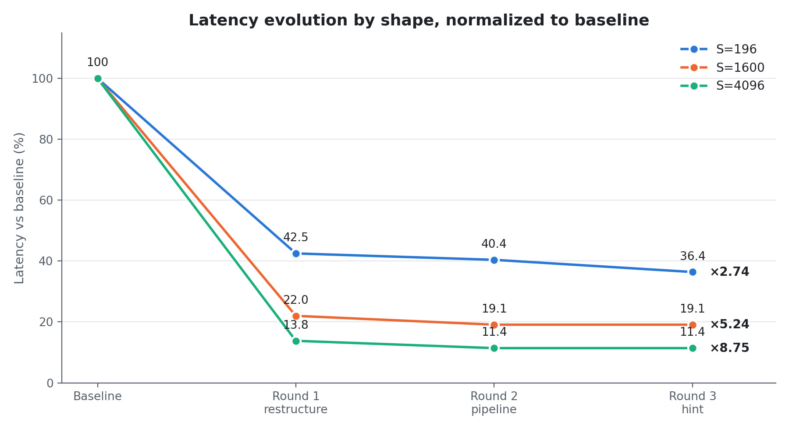

# Attention 融合算子 Ascend 性能优化（自读理解版）

> 本文是《attention融合算子优化报告》的**自读版**：去掉授课式的节奏与提示指令，补齐背景概念，按"问题 → 改法 → 效果"连续成文，供独立阅读理解。所有数字与原报告口径一致。

---

## 0. 先建立整体图景

### 0.1 这个算子算什么

Attention 是 Transformer 的核心计算：每个 query 向量 Q[i] 与所有 key 向量 K[j] 做点积得到相关性分数 score，经 softmax 变成概率 P，再对 value 向量 V 加权求和。现代推理框架用 **FlashAttention 形式的融合实现**：K/V 分块流入片上、softmax 在线归约、概率块从不落回显存，避免巨大的中间矩阵反复读写。

本算子 `attn_rel_h_rel_w` 来自 DeepSeek-OCR 的视觉编码器，在标准 FlashAttention 之上多了一项：**REL_H / REL_W 二维查表偏置**。

背景：视觉 token 是把文档图像切成 `side × side` 的二维网格后**展平成一维序列**的（S = side²）。展平破坏了空间结构，所以要用位置偏置把"两个 token 在原图里的相对位置"补回来。key 的下标 j 反映射回二维坐标——行号 = `j//side`，列号 = `j%side`——然后从两张小表里各取一个数相加：

```text
score[i,j] = Q[i]·K[j]/sqrt(D) + REL_H[i, j//side] + REL_W[i, j%side]
P = online_softmax(score)
O = P @ V
```

- **REL_H 是行偏置**：只关心 key 在第几行；
- **REL_W 是列偏置**：只关心 key 在第几列。

两表形状均为 `[batch, seq_len, heads, w_aligned]`（`w_aligned = ceil(side/8)*8`，8 对齐填充），按 head 独立。相比完整的 S×S 偏置矩阵，分解成两张 `seq_len × side` 的小表省得多，而且能整块常驻片上。

### 0.2 跑在什么样的硬件上

Ascend 是 **Cube/Vector 异构架构**，理解本文所有优化的前提是分清两套执行单元和存储层级：

| 概念 | 含义 |
|---|---|
| AIC（Cube 核） | 专职矩阵乘的核，两次 GEMM（QKᵀ 和 PV）在这里执行 |
| AIV（Vector 核） | 通用向量核，scale、查表偏置、softmax、rescale 在这里执行 |
| GM | 显存（全局内存），容量大但访问慢 |
| L1 | 核内的第一级片上缓存 |
| L0C | Cube 单元内部的累加结果寄存器 |
| UB | Vector 核的片上内存，SIMD 指令在这里读写数据 |
| ND 布局 | 普通的行主序（逐行）存储 |
| NZ 布局 | 分块转置布局（块内按列存），是 Cube 做矩阵乘时**对输入布局的要求** |

本任务的组织方式是 **1 AIC + 2 AIV 协作**：QKᵀ 的结果先落在 L0C，拆成两半交给两路 AIV 的 UB 做 bias+softmax；softmax 产出的概率 P 又要喂回 Cube 做第二次 GEMM（PV）。**性能由"Cube 和 Vector 两条管线的交接质量"决定，而不是任何单条管线**——这是全文最重要的一句。

### 0.3 测试环境与三个 case

| 项目 | 值 |
|------|-----|
| 设备 | Ascend950DT_9592（V120），36 AIC / 72 AIV，满频 1650 MHz |
| 软件 | CANN 9.1.0，tilelang-deepseek（以 TileLang 风格描述、编译生成 AscendC 混合核） |
| 数据类型 | bf16 输入，FP32 累加，概率 BF16 |
| case | side = 14 / 40 / 64 → S = 196 / 1600 / 4096，heads=12，D=64 |

一个贯穿全文的数：每个 key 块覆盖 128 个 key（block_N=128），所以三个 case 的 **key 块数分别是 2 / 13 / 32**。这个数字决定了后面两个"阈值分派"（compact NZ 和流水深度）给谁启用。

---

## 1. 原始实现为什么慢

原始实现的结构（示意）：

```python
for task_id in T.Persistent(...):          # 每个 task 处理一个 (batch, head)
    Q_L1 = copy(Q[task_id])                # Q 进 L1 常驻；两张 bias 表进 UB
    for key_block in T.serial(key_blocks): # ← 问题①：五段工作全串行
        K_L1, V_L1 = copy(K/V[key_block])
        QK(Q_L1, K_L1 → score_L0C)         # Cube
        score_UB = dual_copy(score_L0C)    # L0C 拆半给两路 AIV
        bias_and_softmax(score_UB → prob_UB)  # Vector
        P_L1 = dual_copy(prob_UB)          # ← 问题④：ND→NZ 重排藏在拷贝里
        PV(P_L1, V_L1 → out_L0C)           # Cube
        rescale(...)                       # Vector
```

`T.serial` 意味着每个 key 块必须**依次**经历"K/V 搬入 → QK → bias+softmax → PV → rescale"五段，Cube 干活时 Vector 等着、Vector 干活时 Cube 等着，互不掩盖——这是问题①。

对生成代码逐段清点（S=4096），每 key 块每 AIV 共 **4294 条指令**：bias 2438 / softmax 1344 / ND→NZ 重排 128 / rescale 384。其中藏着三处纯浪费：

**问题②：key-only 索引逐行重算。** 查表偏置需要先算出每个 key 的行列坐标（`j//side`、`j%side`，涉及 int16 微码除法 `vdiv`，单条很贵）。这些索引**只依赖 key 的列位置，与 query 行无关**，却写在 64 行 query 的循环里——同样的 9 条索引指令被重复计算 64 行 × 2 向量 = 128 次（共 1152 条）。手写 SIMD scope 内编译器不做自动外提，必须人工改。

**问题③：gather 的退化使用。** 当 `side=64` 时，一个 64-lane 向量恰好覆盖偏置表的一整行：REL_H 对所有 lane 是**同一个行号**（本可以一条广播读搞定），REL_W 是 **0..63 连续列号**（本可以一条连续读搞定）。但原始实现一律走 gather（逐 lane 独立取址的慢路径）——索引指令算出的是"恒定 + 0..63"的平凡序列，gather 干的是广播/连续读就能完成的活。

**问题④：ND→NZ 布局中转。** softmax 按 ND（逐行）把概率写进 UB，然后拷贝到 L1 时再做 ND→NZ 重排——128 条重排指令 + 16 KB 中转空间，只为满足 PV Cube 对输入布局的要求。

基线成绩（注意 vec_ratio 很高）：

| 指标 | S=196 | S=1600 | S=4096 |
|---|---:|---:|---:|
| TaskDuration | 33.2 us | 469.2 us | 2514.7 us |
| AIV vec_ratio | 0.769 | 0.870 | 0.878 |

**vec_ratio 高 ≠ 没有优化空间**：Vector 很忙，但忙的很大一部分是重复计算和布局中转这类"无效工作"。这是本文反复出现的诊断主题。

---

## 2. 第一轮：消除数据流冗余（收益大头）

### 2.1 优化 1：key-only 索引外提

按数据依赖分类：只依赖 key 的计算（9 条索引指令）提到 query 行循环外、每个向量算一次；只依赖 query 的加载留在行内。指令账：**1152 条 → 18 条**。关键不是"少写几行代码"，而是手写 SIMD 里编译器不会替你做外提，必须自己按依赖重新安排循环层级。

### 2.2 优化 2：side=64 走连续 bias 路径

利用整除关系做**编译期分派**：`side % 向量宽度 == 0` 时，64 个连续 key 的坐标模式是"行号恒定 + 列号 0..63 连续"，直接生成一条广播读（`BRC_B16`）+ 一条连续读（`UNPK_B16`），索引指令、gather、尾块掩码根本不出现在生成的指令流里。`side=40` 不整除（64 个 key 跨多行、中途回卷），保留 gather 慢路径。

通用原则：**不规则索引尽量前置到可向量化的阶段批量处理；整除关系成立时，地址模式本身就是索引，连索引计算都能消掉。**

### 2.3 优化 3：softmax 直写 NZ（生产者直写消费者布局）

核心洞察：既然 PV 需要 NZ，那 softmax 这个**生产者就直接生成 NZ**，而不是先写 ND 再让拷贝去转。实现利用了 NZ 的块内交错结构恰好等于偶/奇元素交错：

1. `vcvt(part=0/1)` 把偶/奇位元素的 BF16 分别放进 32-bit lane 的低/高半（另一半为 0）；
2. 一条 `vor` 按位拼合成交错的 BF16 对；
3. `vsstb` 按 NZ stride 散写落盘——等价于**在寄存器内完成 ND→NZ**。

UB→L1 的拷贝随之退化为纯连续搬运，128 条重排指令和 16 KB staging 全部消失。

**代价**：softmax 从单遍在线变成两遍扫描（先求本块 row-max，再 exp/写盘/求和）。块数少时摊不回来——所以设阈值 **key_block_count ≥ 13 才启用**，S=196（2 块）保留 ordinary 单遍路径。

### 2.4 第一轮结果

三项叠加（并补开基础 2-stage 流水）后：

| 指标 | S=196 | S=1600 | S=4096 |
|---|---:|---:|---:|
| TaskDuration（旧 → 新） | 33.2 → 14.1 | 469.2 → 103.3 | 2514.7 → 346.7 |
| 加速倍数 | ×2.35 | ×4.54 | ×7.25 |
| AIV vec_ratio（旧 → 新） | 0.769 → 0.465 | 0.870 → 0.765 | 0.878 → 0.812 |

注意一个反直觉现象：**S=4096 的 vec_ratio 反而从 0.878 降到 0.812，但时延大降**。解释：高价冗余指令被消掉后，Vector 上剩下的都是有效工作，忙碌占比自然下降；同时关键路径转移到了 Cube/Vector 的**交接空档**——这正好引出第二轮。

---

## 3. 第二轮：流水深度按 shape 分派

第一轮后各管线占比（S=4096，2-stage）显示两侧都没吃满：AIV 侧 vec 70.2%、scalar 7.4%、mte2 5.3%、mte3 16.9%；AIC 侧 cube 20.0%、mte1 15.0%、mte2 49.6%、fixpipe 27.3%。空档不在单条管线内部，而在 **Cube、Vector 与搬运的互相等待**——这正是加深软件流水要吸收的部分。

改法：`T.serial` 已在第一轮换成 `T.Pipelined`，本轮把**流水深度做成按 key 块数分派的编译期参数**：

- 块数少（S=196 仅 2 块）：加深到 3-stage 摊不平缓冲成本，保持 2-stage（第一轮前甚至是 1-stage 全串行，补到 2-stage 也有 5.7% 收益——短循环也能从双缓冲受益）；
- 块数 ≥ 13（S=1600 的 13 块、S=4096 的 32 块）：加深到 3-stage。

循环体一条指令不变，变的只是缓冲与调度。结果：

| case | 流水变化 | TaskDuration |
|---|---|---|
| S=196 | 1 → 2-stage | 14.1 → 13.3 us（+5.7%） |
| S=1600 | 2 → 3-stage | 103.3 → 89.5 us（+13.4%） |
| S=4096 | 2 → 3-stage | 346.7 → 287.9 us（**+17.0%**） |

时间线证据（同机同批采集，代码相同仅 stage 数不同）：3-stage 图中 Cube 批次更密、两路 AIV 的等待区间明显变短——收益来自**跨块重叠**，不是单条指令变快。

单核组数据（S=4096，core0 的 1 AIC + 2 AIV，墙钟 289.8 us）进一步确认：AIV0/AIV1 的 VECTOR 只有 36 个事件却分别忙碌 278.0/277.7 us（**95.9%/95.8%**）——长连续段、几乎无空档，说明块间交接已被流水藏住。AIC 四条管线（CUBE 57.0% / MTE1 30.3% / MTE2 51.8% / FIXP 59.0%）互相重叠，占墙钟之和远超 100% 是真实重叠的标志。


---

## 4. 第三轮：校准调度器的成本模型

最后一处瓶颈很隐蔽：编译器自动调度依赖 **op-count 成本估计**，而它对 ordinary softmax（约 1344 条 SIMD ops）这个 scope 系统性低估，导致给出的重叠预算不足。

改法是给 `T.SimdVF` 传一个 **latency hint**——向成本模型补充信息的接口：

```python
with T.SimdVF(latency=948):   # 1344 ops ÷ 1.41 ops/cycle（参考实现实测口径）≈ 948
    ...                        # softmax 指令体一条不变
```

调度器拿到合理量级的代价估计后，重排 stage 结构。**指令体不变，变的只有生成调度。** 4 次独立复测中位数 13.3 → 12.1 us（+9.0%）——注意这**仅是 S=196 的收益**，S=1600/4096 时延不变（它们的关键路径已不在此）。

方法论要点：成本模型校准是"改调度"不是"改指令"；一次只标一个经 Profile 确认的瓶颈 scope，不要扩散。

---

## 5. 最终结果与三个 shape 的剩余瓶颈

| 版本 | S=196 | S=1600 | S=4096 | 累计加速 |
|---|---:|---:|---:|---|
| 原始实现 | 33.2 us | 469.2 us | 2514.7 us | — |
| + 数据流重构 | 14.1 us | 103.3 us | 346.7 us | ×2.35 / ×4.54 / ×7.25 |
| + 流水深度分派 | 13.3 us | 89.5 us | 287.9 us | ×2.49 / ×5.24 / ×8.74 |
| + latency hint | **12.1 us** | 89.5 us | **287.5 us** | **×2.74 / ×5.24 / ×8.75** |



完成流水后，三个 shape 的**剩余瓶颈已经各不相同**，继续优化要分别对症：

- **S=4096：Vector 指令吞吐主导。** vec_ratio 96.6%（关键核 97.1%）、空隙仅 7.4 us（2.6%）；GM→L1 流量 399 MB、带宽占用仅 6.9%——访存不构成约束，再要快只能减指令。
- **S=1600：128B strided burst 的访问结构问题。** AIC mte2 高达 63.9% 但带宽占用仅 3.6%、平均传输粒度仅 0.41 KB——不是带宽饱和，而是访问粒度太碎；L2 hint 与 group_size 调整均未获益。
- **S=196：固定同步开销与核间负载不均主导。** vec 仅 46.2%；48 个 task 分到 36 个核组分不均，最快核 7.5 us、最慢核 13.4 us——小 shape 的时延下限由这两项决定。

---

## 6. 可复用的方法论

**诊断顺序**（对本类 Cube/Vector 混合算子）：

1. 先看 AIV/AIC 各 pipe ratio，锁定关键路径（注意口径：72 核均值 ratio 与关键核 trace 占空不是同一统计量）；
2. 主导 pipe 占满后，看关键核 trace 的空隙——空隙 2.6% 就别再填空档了，转向减指令、重组数据流；
3. 时延降但 vec_ratio 也降 → 关键路径迁移的信号，对照生成 schedule 确认，然后考虑加深流水；
4. 搬运占比高 ≠ 带宽饱和，要乘上带宽占用和平均传输粒度一起看；
5. 核间忙闲不均看 aiv_time 的 min/avg/max spread。

**几条被实测验证过的工程纪律**：

- "写了注解" ≠ "优化完成"：`multi_buffer_eligible` 被调度器忽略、外层裸 `num_stages` 生成代码逐行未变、嵌套版本注解导致版本膨胀——必须验证 lowering 是否消费、生成代码是否变化、上板时延是否变化；
- 指令数、搬运连续性、流水深度都只是**代理指标**：`vmadd` 指令更少但更慢、4-stage 更深但无收益、Vector 有空档时减指令根本不兑现（索引守卫实验 346.7 → 346.3 us 中性）——代理指标用于提出假设，采纳与否以同条件上板 A/B 为准；
- 三轮的顺序本身就是经验：**先消除数据流冗余，再填 C/V 交接空档，最后校准调度成本模型**；指令级削减只有在 Vector 成为关键路径后才可能变现。
