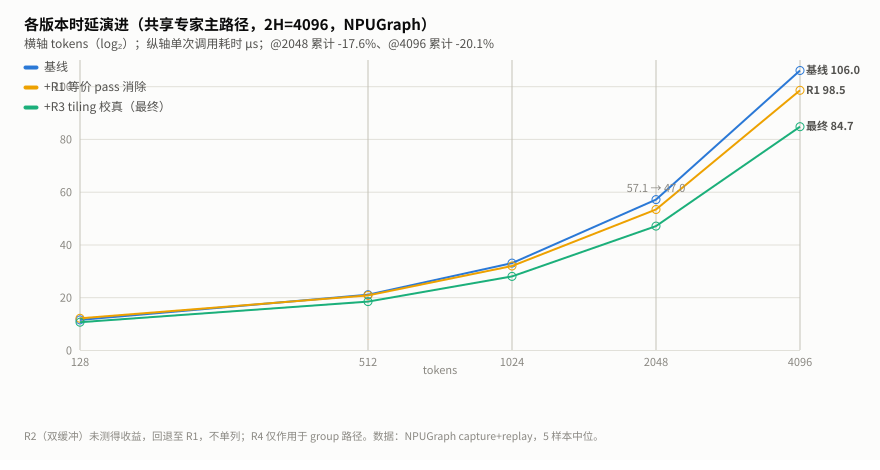
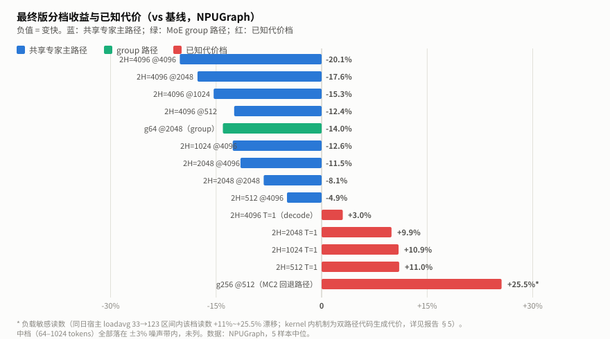
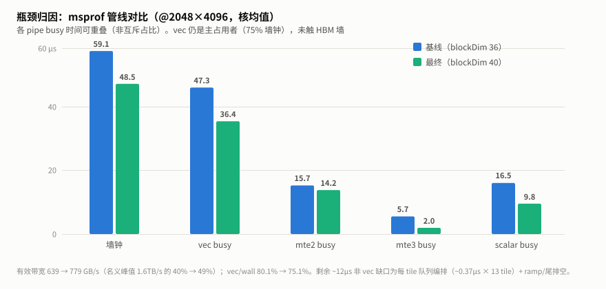

# dequant_swiglu_quant 融合算子 Ascend 性能优化报告

## 1. 背景

W8A8 动态量化推理里，MoE/共享专家的 FFN 前半段是一串「量化矩阵乘 → 反量化 → SwiGLU → 动态量化」：矩阵乘输出 int32，必须先乘回浮点域、过激活、再量化成 int8 喂给下一层矩阵乘。vLLM Ascend 插件的自研算子 **`dequant_swiglu_quant`** 把这三步融为一个 kernel，省掉两轮中间张量的 HBM 往返，是 DeepSeek 类 W8A8 量化模型每层 MoE 的必经路径。

本文档总结该算子在 Ascend 910B3 上的性能优化。这是同族第三役（前两役：rms_norm_cast、add_rms_norm_bias），方法论直接沿用——严格断言先行、等价变换优先、未动路径作噪声金丝雀、负结果留档——并新增三条本算子特有的经验：**分派实证要以设备上的 tiling key 为准（两个生产调用方都命中 817 行的"旧"基类而非 10 个新变体头文件）**、**tiling 公式与 kernel 缓冲布局必须联动校真**、**每 tile 队列编排（而非 MTE2 装载）才是流水缺口的真身**。

### 测试环境

| 项目 | 值 |
|------|-----|
| 设备 | Ascend 910B3（dav_c220 向量核），40 AIV，UB 192KB/核 |
| CANN | 9.1.0 |
| 模型场景 | DeepSeek W8A8：共享专家 2H=4096/TP 度（swiglu_mode=1）；MoE w1 输出恒 2H=4096 |
| 测试矩阵 | tokens = 1/4/16/64/128/512/1024/2048/4096 × 2H ∈ {4096,2048,1024,512}；group 路径 g64/g256 |
| 计时口径 | NPUGraph capture+replay（≈背靠背 serving，5 样本取中位）；msprof op 做管线归因 |

### 算子契约

```text
f     = fp32(x_int32) × weight_scale[2H] × activation_scale[row]   # 反量化
gate/up = f 左/右半（activate_left 可翻转）
swiglu_mode=1（SwiGLUGate）: clamp(limit) → up += β → silu(α·gate) × up   # gpt-oss 风格
swiglu_mode=0（普通）      : silu(gate) × up
scale = max|swiglu行| / 127 (fp32)
y     = int8( RINT(swiglu/scale) 经 half 中转 TRUNC )              # 动态量化
```

数值链 fp32 → RINT → int32 → half(ROUND, deq 1.0) → int8(TRUNC)；half 中转对
[-127,127] 的整数值无损。

### 结论摘要

| 项目 | 结论 |
|---|---|
| 生产主路径 | 共享专家（每层、prefill+decode）与 MoE MC2 回退路径都命中旧基类 `DequantSwigluQuantBase`，tiling key 200000000 / 1e8 / 1.1e8；10 个变体头文件无生产调用方 |
| 基线瓶颈 | vec 吞吐（busy 占墙钟 80%）+ 每 tile 队列编排缺口（~0.37µs/tile）+ 36/40 核上限 + group 路径核分派失衡 |
| 核心方案 | 等价 pass 消除（-6.6%）、tiling 校真（40 核 + 公式 db=1 + 饱和守卫）、group 环形核分派 |
| 最终收益 | 共享专家 @2048 **-17.6%**（57.1→47.0µs）、@4096 **-20.1%**（106.0→84.7µs）；MC2 group prefill **-14.0%** |
| 最终状态 | wall 48.5µs、vec 36.4µs、有效带宽 779GB/s（名义峰值 49%）——仍 vec-bound，未触 HBM 墙 |
| 正确性 | 原 5 用例 + 新增严格 45 用例，5 轮全绿零回退 |
| 已知代价 | decode 1-4 token +0.1~0.35µs（标量延迟域，同族先例量级）；MC2 cut-group 回退路径 +11~25%（负载敏感，机制已定位） |
| 已回退方案 | tile 双缓冲（db=2）：零收益——MTE2 从不在关键路径 |

---

## 2. 算子在大模型中的位置与数据

### 2.1 位置

```text
token embeddings
  → N × decoder layer
       attention 输出 → npu_dynamic_quant → W8A8 矩阵乘(int32 out)
       共享专家: npu_quant_matmul → 【dequant_swiglu_quant】→ int8 ↓proj   ← 每层必调
       路由专家: grouped_matmul（fusion 默认）或
                 gmm1 → 【dequant_swiglu_quant(group_index)】（MC2/fusion 关闭时）
```

两个调用方（`shared_experts.py`、`w8a8_dynamic.py`）的参数画像一致：x=int32、
dynamic 量化、bias/quant_scale 均为 None——都落入 DskTiling 的能力域。

### 2.2 分派实证——本役第一课：优化对象在 817 行的"旧"文件里

算子有 13 个 kernel 源文件、三套 tiling 模板（按优先级 DskTiling=0 →
DequantSwigluQuantTiling=1 → arch35=1000/2000）与 10 个新变体头文件
（dynamic/static × base/bf16/bias_float/bias_int32/performance）。静态走读
给出分派条件后，**以 msprof `OpBasicInfo.csv` 的 kernel 名后缀（即 tiling
key）在设备上钉死**：

| 调用方 | 配置 | tiling key（设备实证） | kernel |
|---|---|---|---|
| 共享专家（每层） | x=int32、无 group、swiglu_mode=1 | **200000000**（blockDim 36→40） | `DequantSwigluQuantBase` |
| MoE MC2 回退 | x=int32、group_index=每组行数 | **100000000**（普通）/ **110000000**（cut：组数≥32 且均摊≤16 行） | Base / `DequantSwigluQuantGroup` |
| （无生产调用方） | bf16/fp16 x 直入等 | 10000-30013 | 10 个变体 hpp |

**DskTiling 的能力域 = group_index 存在，或（x=int32 且 swiglu_mode=1）**——
两个生产调用方全部命中，即优化只须打 817 行的 `dequant_swiglu_quant.h` +
62 行的 `cut_group.h`；10 个新变体头文件只需保回归。若按"新文件=热路径"的
直觉去优化变体族，全部工作量会落在零收益路径上。

两个调用契约陷阱（留档）：group 路径要求 weight_scale 为 2D [组数, 2H]；
`group_index` 语义是**每组行数**（`cumsum_group_list(..., 1)` 的
dst_list_type=1），传 cumsum 会让 kernel 按递增值当行数累加越界，表象是
aivec 崩溃（MTE 非法 GM 地址），极像 kernel bug。

### 2.3 基线画像（msprof @2048×4096，36 核）

| 指标 | 值 | 判读 |
|---|---:|---|
| wall | 59.1µs | NPUGraph 57.1 一致 |
| vec busy | 47.3µs（**80% 墙钟**） | 主占用者，vec 吞吐瓶颈 |
| mte2 / mte3 busy | 15.7 / 5.7µs | 装载/落盘未完全重叠 |
| scalar busy / vector_stall | 16.5µs / 42.5µs | 发射线程被 V 串行链顶住 |
| 有效带宽 | 639GB/s（名义 40%） | **非带宽墙**，优化空间在 vec 侧 |

每行（H=2048）约 22 遍全宽向量 pass，其中 4 遍可等价消除（weight scale
广播拷贝每 tile 重复、两次去交错拷贝、β=0 时的无效 Adds）；每 tile 固定
开销 ~0.37µs × 29 tile/core；36 核上限闲置 4 核；20.5KB 死分配（tmpBuf2，
全仓无引用）。

---

## 3. 优化总览

| 轮次 | 手段 | 针对的问题 | 结果 |
|---|---|---|---|
| R0 | 严格断言测试（45 用例，golden 按 kernel 精确 fp32 链、无 bf16 预舍入） | 原测试 golden 先转 bf16 再量化，atol=1 恰好吸收 scale 类缺陷 | ✅ 裁判先行 |
| R1 | 等价 pass 消除：ws 行乘、去交错消除（原地 strided 半区运算）、β=0 跳过、死分配删除 | 22 遍全宽 pass 中 4 遍冗余 | ✅ @2048 -6.6% |
| R2 | tile 双缓冲（db=2）+ 队列握手合并 | 假设的 MTE2 串行等待 | ⛔ **零收益**（负结果，全回退） |
| R3 | tiling 校真：36→40 核、公式 db=1、饱和守卫、删 mode0 强制 tile | 核数闲置、tile 尺寸被历史公式压小、小批量核饥饿 | ✅ 累计 -17.6% |
| R4 | group 环形核分派 | 每组都从 core 0 分派，尾核闲死 | ✅ 受害 shape -14.0% |
| R5 | 结案：候选池 12 项全评估（4 兑现 / 3 负结果 / 5 留档分级） | — | ✅ 收官 |

**经验法则**：先用设备实证钉死分派 → 严格断言先行 → 等价变换减 pass →
tiling 与 kernel 缓冲布局联动校真 → 分派均衡 → 每步用未动路径 + eager ref
双金丝雀校准噪声（共享宿主 loadavg 33→123 的漂移曾使小档读数 ±10%）。

---

## 4. 逐轮优化过程

### 4.1 R0：严格断言是性能优化的前提

原测试 5 用例全部落在"无 group + swiglu_mode=1 + clamp=0"一种配置上，golden
把 swiglu 转 bf16 再 `npu_dynamic_quant`——而 kernel 直接量化 fp32 值，两
者的 bf16 舍入差恰好被 atol=1 吸收，**per-row/per-group scale 类缺陷在该
容差下不可见**。严格版 golden 逐操作复刻 kernel 数值链
（(ws×x)×act → SwiGLU(α/β/clamp) → 行max×1/127 → 除 → RINT → int8），断言
y=atol 1/rtol 0、scale=rtol 1e-5、零行钉死（scale==0, y==0）；补齐 group
（ragged/空组/cut/mode1+group/>16 行组）、mode0、clamp>0、α/β、
activate_left 翻转、act=None、2D ws、tile 尾、36 核边界、极值、全负行、
9 条拒绝路径。基线 45/45 全绿后才动第一行 kernel 代码。

开发期两个陷阱留档：模块级 `enable_custom_op()` 忘调用时拒绝路径用例会
"假通过"（任何异常都算拒绝）；给 op 传 CPU 张量会以设备端非法 GM 崩溃
而非 host 报错。

### 4.2 R1：等价 pass 消除（-6.6%）

四项位级等价变换：

```cpp
// ① weight scale 行均匀 → 逐行直乘，消掉每 tile 的 [p,2H] 广播拷贝
for (row = 0; row < proDimsx; ++row)
    Mul(xRow, xRow, weightScale, 2H);
// ② SwiGLU 直接在交错半区上原地进行（clamp/β/silu in place），
//    仅最终乘法物化 [p,H] 结果供量化段 → 消掉两次去交错拷贝
// ③ β==0 时跳过 Adds（x+0.0 恒等；-0.0→+0.0 翻转不影响 int8 乘积）
// ④ 删除 tmpBuf2 死分配（swigluMode==1 时分配 5B/输出元素、全仓无引用）
```

**门槛是本轮的主课**：per-row 形态用少量指令换向量工作量，只在 vec-bound
形状赚回。初版门槛 `proDimsx ≤ 8` 使 2H=2048（p=5）回退 +8.6%、cut-group
decode（每组单 tile）回退 +5.8%；修正为
`rowPath_ = (UbFactorDimx ≤ 4) && (ubDimxLoop ≥ 2)`——**判据必须是运行时
形态（每核 tile 数）而非静态 tile 参数**，单 tile 核是 issue-bound，+3 条
指令直接上关键路径。



### 4.3 R2：tile 双缓冲——一个完整的负结果

按固定模板记录（假设 → 实验变量 → 控制变量 → 设备观测 → 结果 → 结论 → 回退）：

1. **假设**：xActQueue 单缓冲使下一 tile 的 MTE2 装载串行在 V 计算之后；
   DB_BUFFER=2（tiling 公式本就按 db=2 预留）应隐藏每 tile ~0.5µs 的
   装载等待，预期大档 -10~15%。
2. **实验变量**：DB_BUFFER 1→2 与 outQueue 双缓冲（kernel 缓冲数）、
   ComputeDequant→ComputeSwiGLU 之间的 EnQue/DeQue 握手合并（单次
   DeQue/Free）；过程中按二分法拆出溢出修复（删 mode0 强制 tile 特例、
   outQueue 回 db=1）与纯增益测量两个阶段。
3. **控制变量**：数据、shape、设备、测量口径全部不变；每轮 clean build +
   md5 自检 + 45 用例精度回归。
4. **设备观测**：
   - 首版**崩溃**（VEC 指令 UB 越界）：mode0 特例强制 p=4@2H=4096 是
     db=1 时代的调优，db=2 下 xActQueue 翻倍后总量 232KB > 192KB；
   - 修复溢出后：NPUGraph @2048 53.85µs vs R1 53.33µs（±1%）；msprof
     MTE2 busy 15.7→**19.2µs**（装载确实被隐藏了）而 **vec/wall 80.2%
     纹丝不动**。
5. **性能与正确性结果**：正确性 45/45（含崩溃版被 strict 当场拦截）；
   性能收益为零——基线 ~20% 非 vec 墙钟**从来不是 MTE2 等待**，而是
   每 tile 的队列编排（Alloc/EnQue/DeQue/Free 事件往返 ~0.37µs ×
   29 tile）+ ramp/尾排空。MTE2 预取本就由跑前瞻的标量线程提前发出
   （db=1 时由 Free 事件链保护）。
6. **结论**（按强度分级）：**实测**——db=2 对本算子零收益，流水缺口在
   队列编排不在装载；**确定性事实**——tiling 公式（db 预算、强制 tile）
   与 kernel 缓冲布局失配会无声压小 tile 或直接溢出崩溃；**待验证假设**
   ——手工事件编排可回收编排开销的大半（估 -10~15%）。
7. **回退及原因**：整体回退（db=2、outQueue 双缓冲、握手合并全部还原，
   保持与基线最小 diff）；负结果与机理留档，避免未来重推同路。

### 4.4 R3：tiling 校真（累计 -17.6%）

三项 tiling 改动（kernel 与 R1 相同）：

1. **核数 36→40**：36 来自 DeepSeek V4 移植，无文档理由；设备 40 AIV。
2. **公式 db 校真**：公式按 db=2 预算而 kernel 实为 db=1（历史失配），
   tile 被无声压小——校真后 p 取真实上限（2H=4096：2→4）。
3. **饱和守卫**：大 tile 减边界开销，但小批量下会减核数（ceil(T/p)），
   丢并行比省 tile 更贵。规则 `p = min(p_max, max(p_legacy, ceil(T/40)))`：
   只在所有核饱和时才用更大的 tile；p_legacy 按历史公式复算以精确复现
   基线小批量行为。

**两次守卫迭代（负结果留档）**：
- 初版反向 cap（p ≤ ceil(T/40) 保核数）：**方向全错**——小 2H 的每 tile
  固定开销远大于并行度收益，2H=512/64 行：32 核 × 2 行 tile 比 3 核 ×
  22 行 tile **慢 72%**。大 tile 优先，守卫只在大 tile 开始吞核数时介入。
- 公式 db 失配期间 T=128 因 p=3 产生 3+1 尾 tile（+17%）——db 校真后
  p=4 整除恢复。

### 4.5 R4：group 环形核分派（受害 shape -14.0%）

审计发现的真缺陷：非 cut group 路径里每组都从 core 0 重新分派
（`if (blockIdx_ < realCoreDim)`），组间不复用核序——64 组 × 32 行时全部
落在 core 0-31、32-39 闲死，比均衡的 cut 路径同工作量慢 1.5×
（93.0µs vs 61.4µs）。修复：`Process()` 维护环形核偏移，每组的核区间从上
一组结束处轮转（mod blockDim），组内行块按环内位置分配。适用面：组数
< 32 或均摊 > 16 行/组的全部非 cut 形态（EP 每卡专家数 < 32、MC2 prefill）。



### 4.6 已知代价：接受什么、为什么

| 代价档 | 量级 | 机制 | 为什么接受 |
|---|---|---|---|
| decode 1-4 token（全 2H） | +0.1~0.35µs（3.1→3.4µs） | T=1 时 kernel 是标量延迟瓶颈（scalar busy 2.27µs ≫ vec 1.07µs），双路径 kernel 的分支/代码生成扰动落在标量关键路径 | 同族 add_rms_norm_bias 已发布同类 +0.3-0.5µs 结构性代价；生产 decode 中共享专家跑在与路由专家重叠的旁流。已实验排除 UB 布局、db、握手合并三个假设，归因到代码生成层 |
| g256@512（MC2 cut-group decode 回退路径） | +11~25%（读数随宿主负载漂移） | 同一代码生成机制（该路径 kernel 逻辑本身未改动） | 该路径仅在 fusion 显式关闭时启用，代码注释标记为待删除；缓解需按 shape 类拆 kernel |

### 4.7 总收益与最终状态

**累计优化（NPUGraph，共享专家主路径 2H=4096，µs）**：

| tokens | 基线 | +R1 | +R3/R4 最终 | 累计 |
|---:|---:|---:|---:|---:|
| 512 | 20.98 | 20.72 | **18.38** | **-12.4%** |
| 1024 | 32.96 | 31.86 | **27.93** | **-15.3%** |
| 2048 | 57.06 | 53.33 | **47.02** | **-17.6%** |
| 4096 | 106.01 | 98.46 | **84.73** | **-20.1%** |

2H=2048 @4096 -11.5%、2H=1024 @4096 -12.6%、2H=512 @4096 -4.9%；
group 路径 g64@2048 **-14.0%**（93.0→80.0µs）；中档（64-1024）持平至 -6%。



**关键路径分解**（@2048×4096 最终态，msprof）：wall 48.5µs = vec 36.4µs
（75%）+ 每 tile 队列编排 ~0.37µs × 13 tile + ramp/尾排空。有效带宽
779GB/s（名义峰值 49%）——**离 HBM 墙尚远，剩余空间在 vec 侧与编排侧**
（手工事件编排估再 -10~15%，留档）。

---

## 5. 归因速查表与关键经验

### 5.1 归因速查表

| 症状 / 问题 | 看什么 | 本例读数 → 结论 |
|---|---|---|
| 不确定优化对象 | msprof `OpBasicInfo.csv` 的 kernel 名后缀（= tiling key） | 两个生产调用方都命中 817 行旧基类（key 200000000/1e8/1.1e8），10 个新变体头文件无生产调用方 |
| op 调用即崩（MTE 非法 GM 地址） | 先查调用契约再怀疑 kernel | group_index 要**每组行数**（非 cumsum）、ws 要 2D；传错语义=越界崩溃 |
| 装了新 kernel 行为没变 / 空跑一轮 | build 树源拷贝 md5 + `.done` 门闩 | 沿用前役教训；另：rebase 后陈旧 CMake 缓存会引用已删目标，需清缓存 |
| MTE2 已重叠但墙钟不动 | mte2 busy + vec/wall 双指标 | mte2 15.7→19.2µs 且 vec/wall 80.2% 不变 → 缺口在队列编排不在装载 |
| 双缓冲后崩溃（VEC 越界 UB） | tiling 公式 vs kernel InitBuffer 逐项对账 | 公式 db=2、kernel db=1、特例 p=4 三者失配 → 232KB > 192KB |
| 大 tile 反而更慢 | ceil(T/p) 核数 vs 每 tile 固定开销 | 2H=512/64 行：32 核×2 行比 3 核×22 行慢 72%——**小 2H 大 tile 优先** |
| 收益真假（共享宿主） | 未动路径 + eager ref 双金丝雀 | loadavg 33→123 使小档读数漂移 ±10%；ref 平而 fused +13% 才判真 |
| 小 shape 全档变慢但代码路径相同 | msprof @T=1 的 scalar busy | scalar 2.27µs ≫ vec 1.07µs → 标量延迟域，双路径代码生成扰动 |

### 5.2 关键经验

1. **分派实证先于一切**：多变体算子先用设备上的 tiling key 钉死生产命中的
   kernel 文件；"文件新=路径热"的直觉在本算子上完全失效；
2. **调用契约即坑**：group_index 语义（行数 vs cumsum）与 ws 维度传错都
   表现为设备端崩溃，先证契约再查 kernel；
3. **严格断言的 golden 必须复刻 kernel 的精确数值链**——原测试的 bf16
   预舍入 golden 让 atol=1 变成黑洞；
4. **per-row/双路径等价变换有门槛**：用指令数换向量工作量只在 vec-bound
   赚回，判据要用运行时形态（每核 tile 数）；
5. **tiling 公式与 kernel 缓冲布局是一份账**：db 数、死缓冲、强制 tile
   任何一方改动都要重新对账，否则要么无声压小 tile、要么直接溢出崩溃；
6. **流水缺口先归因再动手**：db=2 是教科书式方案，实测零收益——
   MTE2 早已被跑前瞻的标量线程隐藏，真缺口在队列编排；
7. **负结果完整留档**：db=2、反向 cap、int32→int8 直转（classic API 无
   此类型对，仅 MicroAPI 有）——三个负结果各带机制，避免未来重推。

---

## 6. 附录

### 6.1 复现信息

| 项 | 值 |
|---|---|
| 仓库 / 分支 | vllm-ascend @ `dequant-swiglu-quant-perf`（基线 22c9a5127 → R1 437aad17e → R3 fe190a1e6 → R4 118b9e317 → 结案 75f8daf57） |
| 编译 | `bash csrc/build_aclnn.sh $(pwd) ascend910b` → `pip install -e . --no-build-isolation`；改 kernel 前清 build 树（`{src,bin}/dequant_swiglu_quant` + `gen/*_ascend910b_*.done`）；rebase 后若 CMake 报已删目标，另清 `csrc/build/CMakeCache.txt` 等 |
| 计时 | `python benchmarks/dequant_swiglu_quant.py`（fused vs eager ref，NPUGraph 5 样本中位）；group 路径 `--groups N --swiglu-mode 0` |
| 归因 | `env -u ASCEND_RT_VISIBLE_DEVICES msprof op --warm-up=10 --launch-count=1 --kernel-name="DequantSwigluQuant*" --aic-metrics=PipeUtilization python benchmarks/dequant_swiglu_quant_msprof.py <tokens> <2H> [nogroup|clamp7|group:N]` |
| 精度 | `pytest tests/e2e/nightly/single_node/ops/singlecard_ops/test_dequant_swiglu_quant{,_strict}.py -q`（本环境需 `--noconftest`：环境 vllm 0.29 与分支期望 0.30 的 index_group 缺失，op 级测试自包含不受影响） |
| 原始数据 | 本目录 `原始数据/`：基线/最终记分板 JSONL + 四个关键采集点 msprof CSV
  （baseline / R2 / final @2048×4096 的 PipeUtilization 与 OpBasicInfo、baseline group）；
  仓内 `DEQUANT_SWIGLU_QUANT_OPT_NOTES.md`（逐轮全量记录）、`profiling_dsq_*`（其余采集） |

### 6.2 测量口径

| 口径 | 命令 | 语义 |
|---|---|---|
| NPUGraph replay | `python benchmarks/dequant_swiglu_quant.py` | ≈ 背靠背 serving（graph 内 32 连发、replay 计时），5 样本取中位；记分板专用 |
| msprof op | `msprof op --aic-metrics=PipeUtilization ...` | 孤立峰值，自带 ~3-4µs 固定开销；pipe 归因专用，两口径相对量级一致（本役 @2048：57.1/59.1、47.0/48.5） |

### 6.3 统计口径与噪声

- 表值为 5 样本中位数；共享宿主 loadavg 33→123 的日内漂移使小档
  （<128 tokens）读数有 ±10% 波动，中档 ±3%；
- 判真依据：跨测量时段复现（大档收益三轮一致）+ 未动路径/eager ref 双
  金丝雀（ref 平而 fused 变 = 真变化）；
- 各 pipe busy 统计时间上重叠，非互斥占比。

### 6.4 变体覆盖矩阵（终态）

| 路径 | tiling key | 是否修改 | 性能结论（终值 vs 基线） | 严格测试 |
|---|---|---|---|---|
| 共享专家（无 group，mode1） | 200000000 | 是（R1+R3） | @2048 -17.6%、@4096 -20.1%；T=1 +0.1~0.35µs（留档） | 通过 |
| MoE group 普通 | 100000000 | 是（R1+R3+R4） | g64@2048 -14.0%（R4 环形分派主收益） | 通过 |
| MoE group cut | 110000000 | 是（R1；cut 逻辑未动） | @2048 -6.3%；@512 +11~25%（回退路径，留档） | 通过 |
| 10 个变体 hpp（非生产） | 10000-30013 | 否 | 无生产调用方，仅保回归 | 通过（strict 覆盖 dispatch 边界） |

### 6.5 实现约束与维护红线

沿用前役红线（事件四件套、退出零悬挂标志、局部行号奇偶、累加器 src0 位、
逐元素 V 操作 32B 对齐、UB 预算 host 成本模型化），本役新增：

7. **tiling 公式与 kernel 缓冲布局联动**：改 DB_BUFFER/缓冲分配必须同步
   CountMaxDim 的每行成本项，且历史常量（强制 tile、db 预算）内嵌的旧
   布局假设要显式清算；
8. **tile 尺寸选择带饱和守卫**：`min(p_max, max(p_legacy, ceil(T/核数)))`，
   小批量行为由 p_legacy 锚定，防止大 tile 吞核数；
9. **per-row 双路径的门槛**（`UbFactorDimx ≤ 4 && ubDimxLoop ≥ 2`）改动
   时必须重测 decode 型单 tile 形态（issue-bound 敏感）；
10. **group 分派的环形偏移**依赖 blockDim == maxCoreNum 不变量（tiling
    `PostTiling` 保证），改动 blockDim 逻辑时需同步核对。

### 6.6 遗留候选（按强度分级）

| 候选 | 分级 | 依据 |
|---|---|---|
| 手工事件编排（消每 tile 队列开销 ~0.37µs×tile） | 待验证假设（估 -10~15%） | msprof 缺口定位 + 前役模板可迁移，但需重写 tile 循环 |
| p>4 大 tile | 确定性受阻（UB 算术） | p=5 需 197KB>192KB；需先把量化段改 strided 读省掉 res 物化 |
| decode 档代码生成交价缓解 | 待验证假设 | 需按 shape 类拆 kernel 或 noinline 实验 |
| barrier 审计（44 处 PipeBarrier 必要性） | 待验证假设 | V 内按序执行下同步 barrier 可能冗余，无文档佐证 |
| act-scale 广播 Brcb 化 | 判断不做 | 现实现语义不透明但实证逐行正确，风险/收益不匹配 |
