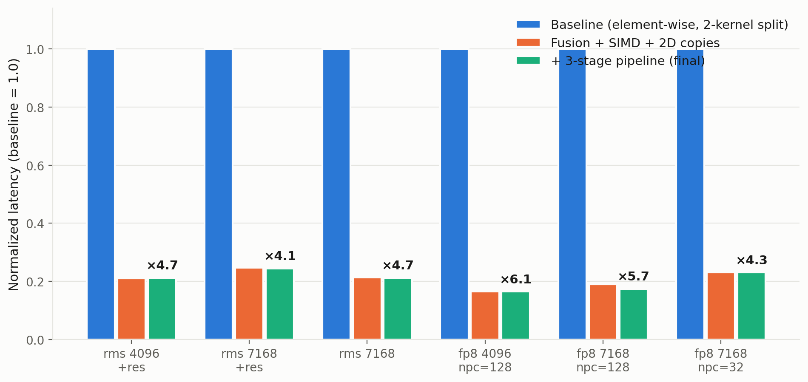

# Norm 融合算子 Ascend 性能优化报告（fused RMSNorm/LayerNorm + FP8 量化）

## 1. 背景

Norm（RMSNorm / LayerNorm）是大模型 Transformer 中出现频率最高的算子：每个 block 在 attention 与 FFN 之后各执行一次，decode 阶段每次前向都要经过。与 attention 的"算力密集"相反，norm 是典型的**访存密集**算子——每个元素只做一次加法/乘法与一行归约，却要整行读入、整行写出，时延几乎完全由 GM 带宽决定。这类算子的优化目标可以一句话说清：**让 DRAM 搬运尽可能接近峰值带宽，其余一切为之让路**。

推理引擎普遍采用 **fused add-norm 形式**：把 residual 相加、（可选的）输入融合变换、归一化、affine、（可选的）FP8 分组量化合并为一个 kernel，避免中间结果反复落 GM。本文档以 TileLang 在 Ascend 平台上的融合 norm 算子实现为对象，总结其性能优化过程。全文经验围绕四条主线展开：**单 kernel 融合与数值锚点、64-lane SIMD 两遍扫描、UB 预算驱动的 tiling、归因驱动的流水设计**。

### 测试环境

| 项目 | 值 |
|------|-----|
| 设备 | Ascend950DT，36 SM / 72 AIV，UB 248KB，GM 峰值 4 TB/s |
| 对照设备 | B200 GPU，GM 峰值 8 TB/s（验收标准：利用率超过同算子在 B200 上的水平） |
| CANN | 9.1.0 |
| TileLang | 内部构建版本（未开源） |
| 测试矩阵 | 16384 tokens × hidden {4096, 7168} × RMS/LN × residual × FP8 npc {32, 128} |
| 数据类型 | bfloat16 输入，FP32 累加；FP8 输出 e4m3 + 分组 scale |

### 算子功能

对外接口与 vLLM 的 `fused_add_rms_norm` 家族对齐。核心计算：

```text
v = x (+ x2 | * x_scale，含 dtype 回舍) + residual     # 可选输入融合
residual_out = v                                       # 可选
y = normalize(v) * w * out_scale (+ bias)              # RMS: /sqrt(mean(v²)+eps)
                                                       # LN:  (v-mean)/sqrt(var+eps)
y_origin = round_dtype(y)                              # 可选
(y_fp8, sf) = per_group_quant(round_dtype(y))          # 可选，组内 amax → scale → 量化
```

验收口径：6 个 benchmark case 的带宽利用率（有效字节 / 时延 / 峰值带宽）逐一超过同一算子在 B200 上的实测利用率；FP8 值与 scale 与参考实现 `per_token_cast` **逐位一致**。

---

## 2. Norm 融合算子在大模型中的位置与数据

### 2.1 位置

```text
Transformer block:
  x → attention → +residual → NORM(本算子) → FFN → +residual → NORM(本算子) → 下一层

量化推理路径中，本算子还输出 FP8 分组量化的 (y_fp8, scale)，
直接衔接后续的 W8A8 GEMM——norm 的输出布局即 GEMM 的输入布局。
```

每个 block 两次、每层必经，decode 阶段（batch 小、算力富余）norm 类访存算子占比显著。融合 FP8 量化后，它同时是量化链路的起点。

### 2.2 输入输出张量

| 张量 | 形状 | 数据类型 | 说明 |
|---|---|---|---|
| x（及可选 x2 / residual） | `[batch, seq, hidden]` | bf16 | 行内连续、行间可带 stride |
| w / bias | `[hidden]` | bf16 | 常驻 UB，全核复用 |
| y | 同 x | bf16 / fp32 / e4m3 | 三种输出 dtype |
| residual_out / y_origin | 同 x | bf16 | 可选输出 |
| sf（scale） | `[batch, seq, hidden/npc]` | fp32 / int16(packed) | npc ∈ {32, 128}，三种布局 |

单行 7168 列 bf16 = 14KB；一行"进 + 出"最少 28KB——hidden=7168 的行宽超过了单个 SIMD 向量的 64 lane × 2000 余倍，**行内必须分块扫描，行间必须多行成组**，这是 norm tiling 的两个基本约束。

### 2.3 数据特点与片上数据流

- **一行两次依赖**：归一化分母（∑v² 或 ∑v 与 ∑(v-mean)²）依赖整行求和，而输出依赖该分母 → 行内**两遍扫描**不可省（一遍算统计量、一遍算输出）；
- **FP8 量化再添一遍**：量化前的 amax 依赖舍入到输入 dtype 的整行值，标准三段式 amax → scale → quantize；
- **优化后形态的片上数据流**：

```text
x(+x2)(+residual) GM ──2D 块搬运──> x_ub 等（per-row buffer，双/三缓冲轮转）
        │
        ▼  Pass 1（SIMD 向量域）：reconstruct v（含融合变换与回舍）
        │                   残差直写 residual_out_ub；行内累加 sum / sum_sq → stats_ub
        ▼  （LN 专属 pass 1.5：中心化平方和）
        ▼  Pass 2（SIMD 向量域）：rstd = f(stats)；reload v → *rstd*w*out_scale(+bias)
        │                   直写 y_ub / norm_ub / y_origin_ub（生产者直写消费者布局）
        ▼  FP8 epilogue（SIMD 向量域，三段）：amax → 批量 scale（64 组/向量）→ 量化
        ▼
y / sf / residual_out / y_origin ──2D 块搬运──> GM
```

weight/bias 按 UB 预算选择**常驻 FP32**（预转换一次）或**原生流式**（每次取向量时转换）两种方案；全部 per-row buffer 参与持久核的双/三缓冲轮转。

---

## 3. 优化总览

| 轮次 | 手段 | 针对的问题 | 参考来源 |
|---|---|---|---|
| 第一轮·融合 | 单 kernel 融合（norm + residual + FP8 量化），建立与 `per_token_cast` 逐位一致的数值锚点 | 中间结果落 GM 的整趟往返 | 生成代码 + 逐位比对 |
| 第二轮·向量化 | 逐元素（SIMT 风格）→ 64-lane SIMD 两遍扫描；多行 tile；persistent 持久核；RMS/LN 共享主体 | 标量/逐元素路径的指令效率 | 生成代码检视 |
| 第三轮·FP8 尾段 | 批量 scale（64 组/向量）、小分组寄存器路径、packed ue8m0 原生 ABI、三段式 epilogue | 逐组标量 scale、非原生存储布局 | 仓内 per_token_cast 参考 |
| 第四轮·搬运与流水 | msprof 归因分流（MTE2-bound vs VEC-bound）→ 2D 块搬运、权重流式、3 级流水 A/B 矩阵、trace 空泡定位 | 搬运粒度与流水深度 | msprof + trace.json + 生成 AscendC |

**经验法则**：访存密集算子先确认"瓶颈在哪条管线"（rms 路径 MTE2-bound、FP8 npc=32 路径 VEC-bound，两类瓶颈方向相反），搬运类优化（粒度、布局、双缓冲）先行，指令级削减只在对应管线成为关键路径后才变现。

---

## 4. 逐轮优化过程

本章按优化顺序组织：§4.1 给出初始版本与瓶颈判定；§4.2–§4.5 四轮各按「问题分析 → 关键变化 → 结果」展开；§4.6 汇总总收益与最终状态。所有收益以正数表示；未标注处均为同口径（pytest benchmark，do_bench/msprof 后端，16384 tokens）测量。

### 4.1 初始版本：逐元素路径 + 两 kernel 拆分

**初始实现结构**（①–④ 标出后续优化的落点）：

```python
# kernel 1：norm 主体（逐元素路径）
for token in persistent_loop(...):         # ① 每核每次只处理一行
    v = x[token] (+ x2 | * scale) + residual
    y = normalize(v) * w + bias            # ② 逐元素：跨线程归约 + 逐元素仿射
    写回 GM                                # ③ 中间结果必须落 GM
# （FP8 场景）kernel 2：per_token_cast 再把 GM 里的 y 读回、量化、再写 GM  # ④
```

**接手基线**（6 case，带宽利用率按 4TB/s 折算）：

| 指标 | rms 4096+res | rms 7168+res | rms 7168 | fp8 4096/128 | fp8 7168/128 | fp8 7168/32 |
|---|---:|---:|---:|---:|---:|---:|
| 时延 (us) | 755.9 | 1099.4 | 662.3 | 919.4 | 1385.7 | 1264.2 |
| 带宽 (GB/s) | 710 | 855 | 709 | 513 | 596 | 662 |
| 利用率 | 17.8% | 21.4% | 17.7% | 12.8% | 14.9% | 16.5% |

**瓶颈判定**：四层叠加——① FP8 路径两 kernel 拆分，中间结果整趟落 GM 再读回（多两次 GM 往返）；② 逐元素路径的指令效率与归约开销；③ 每任务单行，GM 访问粒度小；④ 无跨任务流水。另有一个当时未暴露的问题：FP8 尾段的同作用域"写后即读"竞态（§4.5）。

### 4.2 第一轮：单 kernel 融合与数值锚点

#### 问题分析

FP8 场景下 norm 与量化拆成两个 kernel：y 先写 GM，per_token_cast 再读回、量化、写出——每行多出"一次写 + 一次读"的完整 GM 往返，而 norm 本身就是访存算子，这是最贵的浪费。融合的代价是数值语义：量化的输入必须与拆分时**逐位一致**，否则下游精度对不上。

#### 关键变化

- norm 主体、residual 链路、FP8 分组量化合并进单个 kernel；FP8 的 amax 读取**舍入到输入 dtype 之后的 y**（与拆分实现读 GM 值的语义等价）；
- 建立数值锚点：融合输出与参考实现 `per_token_cast` 做 `torch.equal` 逐位比对，round_sf / packed ue8m0 / 三种 scale 布局全部纳入。此后每一轮优化都在这个锚点下回归——**任何一次改动只要改变输出一位，立即被测试捕获**，这是后面敢于快速迭代的安全网。

#### 结果

融合完成后（早期口径，含行缓冲流水）：bf16 三场景 845.0 / 1230.8 / 746.7 µs，与接手基线（755.9 / 1099.4 / 662.3 µs）相当或略差；FP8 三场景 1764.3 / 2750.5 / 8390.5 µs，其中 npc=32 为基线的 6.6 倍——**融合本身不产生收益**：省下的 GM 往返被尚不成熟的量化尾段吃掉。本轮的产出是数值锚点与单 kernel 结构，收益由第二、三轮兑现。

### 4.3 第二轮：64-lane SIMD 两遍扫描与多行 tile

#### 问题分析

逐元素路径把每个元素编译为单线程标量指令链，且行归约需跨线程同步。Ascend AIV 的 64-lane SIMD 向量单元一次处理 64 个元素，两遍扫描的行归约可用成对求和归约指令在向量寄存器内完成——指令效率差一个量级。

#### 关键变化

```python
vector_domain:                                     # 64-lane SIMD 向量域
    for r in range(block_m):                        # 多行 tile（block_m 行/任务）
        # Pass 1：reconstruct v → 行内累加 sum_sq → stats（单通道写）
        for vec in range(d // 64):
            v_vec = reconstruct_v(...)              # 含 x2/scale/residual 融合与回舍
            acc = vec_add(acc, vec_mul(v_vec, v_vec))
        store_one_lane(stats[r], broadcast(vec_pairwise_reduce(acc)))
    mem_barrier(store_to_load)                      # 统计量写→读的显式屏障
    # Pass 2：rstd = 1/sqrt(mean+eps)；reload v → 仿射 → 直写各输出 buffer
```

- **多行 tile + persistent 持久核**：一次搬 block_m 行，全核持久领取任务；整块 tile 用单条 MTE 描述符 2D 搬运，尾块/跨 batch 回退逐行；
- **RMS/LN 共享主体**：两者只差统计量定义与一次中心化，用编译期分支共享同一段指令流——LN 的额外 pass 1.5 仅在 LN 编译产物中存在，RMS 的指令序列与单独实现逐条一致；
- **权重两方案**：FP32 常驻（预转换一次）vs 原生流式（逐向量转换），按 UB 预算自动选择——UB 预算模型（240KB，含 buffer 版本数与对齐 padding）统一推导 block_m、流水级数与权重方案。

#### 结果

向量化主体完成后（早期口径，对融合态基线 845.0 / 1230.8 / 746.7 / 1764.3 / 2750.5 / 8390.5 µs）：

| 时延 (µs) | rms 4096+res | rms 7168+res | rms 7168 | fp8 4096/128 | fp8 7168/128 | fp8 7168/32 |
|---|---:|---:|---:|---:|---:|---:|
| 融合态基线 | 845.0 | 1230.8 | 746.7 | 1764.3 | 2750.5 | 8390.5 |
| 本轮后 | **198.5** | **341.2** | **171.8** | **336.0** | **587.5** | **2729.1** |
| 加速 | ×4.26 | ×3.61 | ×4.35 | ×5.25 | ×4.68 | ×3.07 |
| 利用率 | 67.6% | 68.8% | 68.4% | 35.1% | 35.1% | **7.7%** |

bf16 路径到 68% 利用率量级；FP8 npc=32 仍只有 7.7%——每行 224 组的逐组精确除法（448 条指令/行）是残余瓶颈，引出第三轮。

### 4.4 第三轮：FP8 量化尾段演进

#### 问题分析

FP8 场景的 epilogue（amax → scale → quantize）最初是逐组标量 scale 计算 + 非原生的 packed 布局。npc=32 时每行 224 个组，逐组标量路径的指令数放大 4 倍；packed ue8m0 的 scale 存储必须与 Ascend 量化链路的 native ABI（int16/pack2）一致。

#### 关键变化

1. **批量 scale**：scale/inverse-scale 计算改为 64 组一批的向量除法与指数运算，写回走紧凑批量拷贝；
2. **小分组寄存器路径**：npc=32 用两个 32-lane 掩码从同一 64-lane 向量一次取两个组 amax，省去重读；
3. **packed ue8m0 原生化**：kernel 内直接产出 Ascend native 的 int16/pack2 scale（biased exponent 字节按打包写指令落盘），host 侧只做视图转换；
4. **三段式 epilogue**：amax → scale → quantize 各段覆盖所有行、每 tile 一次屏障；amax/scale 工作区钉为单版本，避免流水轮转破坏量算。

#### 结果

批量 scale 把 npc=32 每行的精确除法从 448 条降到 ~7 条；scale 与参考实现逐位一致（含 round_sf 指数推导与 1e-4 clamp）。至本轮与 2D 块搬运完成（流水加深前，最终同口径），6 case 达到 159.0 / 272.0 / 141.6 / 151.8 / 264.0 / 291.5 µs，全部超过接手基线（4.0~6.1 倍）。npc=32 与 npc=128 的残余差距经指令账目归因为融合 norm 的固有成本（两遍扫描占向量指令 ~62%），不再投入。

### 4.5 第四轮：归因驱动的搬运与流水（msprof + trace + 生成代码）

#### 问题分析

中段状态之后，凭直觉已难判断下一铲挖哪里——用 msprof 对代表 case 归因，得到**方向相反的两类瓶颈**：

| case | aiv_mte2_ratio | aiv_vec_ratio | 判定 |
|---|---:|---:|---|
| rms 7168+res | **0.986** | 0.553 | MTE2-bound：GM→UB 读几乎全程忙，向量半闲 |
| fp8 7168/32 | 0.871 | **0.993** | VEC-bound：向量管线饱和，搬运有空闲 |

两类瓶颈对应完全不同的优化方向，这决定了投入排序：搬运类手段（粒度、布局、双缓冲）优先，向量指令削减只对 VEC-bound 的 case 才可能变现。

#### 关键变化一：2D 块搬运与权重流式

- 整块 tile 单条 MTE 描述符 2D 搬运（生成代码实证：单条 DMA 拷贝描述符一次搬 28672B = 两行），尾块/跨 batch 逐行回退；
- 权重/_bias 按 UB 预算选择常驻 FP32 或原生流式，解锁宽行场景的多行 tile。

#### 关键变化二：流水深度的 A/B 矩阵

加深流水是提高在飞 MTE 请求数的直接手段，但多级流水吃 UB 预算、挤 block_m。对每个场景做完整配置矩阵（三种流水形状 × 6 场景，每种配置独立进程测量以绕开 jit 缓存）：

| 时延 (us) | (2, bm) 默认 | (3,1) 深流水单行 | (3,2) 深流水双行 |
|---|---:|---:|---:|
| rms 4096+res（bm=3） | 159.0 | 161.2 | 158.9 |
| rms 7168+res（bm=2） | 272.0 | **269.1** | 预算不容 |
| rms 7168（bm=4） | 141.6 | 151.1 | 预算不容 |
| fp8 4096/128（bm=3） | 151.8 | 160.4 | 168.6 |
| fp8 7168/128（bm=1） | 264.0 | **241.4** | 预算不容 |
| fp8 7168/32（bm=1） | 291.5 | 291.5 | 预算不容 |

矩阵结论清晰：**(3,1) 只在 bm≤2 的窄行场景胜出**（fp8 7168/128 −8.2%；rms 7168+res 另以 9 次交错测量复核 −0.9%，两组分布零交叠），bm≥3 一致回退 5%~13%，(3,2) 全面无优势。胜出规则按条件固化进 tiling 启发式（bm≤2 且装得下预算 → 3 级流水），不猜、不泛化。

**指令级时间线（trace.json）的空泡定位**支撑了第二次扩展。对瓶颈 case 做单核三线占用分析（区间并集口径）：

| 管线 | 占用 | 判读 |
|---|---:|---|
| MTE2（瓶颈） | 94.8% | 唯一值得优化的空闲 ≈5%：流水填充/排空 ~2.5%（软件流水固有）+ 双缓冲往返节拍 ~2.5% |
| MTE3 | 98.2% | 近乎完美 |
| VECTOR | 54.4% | 时间线上的空隙是跟随者在等数据——**不是损失** |
| 三线同时空闲 | 0 个区间 | 整体无空泡 |

其中"双缓冲往返节拍"（两版本 buffer 下 load 只能领先计算 1~2 个 wave）恰是第三级流水消掉的部分；余下的填充/排空不随流水级数消失。

#### 关键变化三：竞态的发现与加固（优化过程的插曲）

检视中发现 FP8 尾段存在同作用域"写后即读"竞态：benchmark 全绿、精度偶发失败、错误数逐次漂移（非确定性特征）。最小复现确认后补显式内存屏障，并把同类风险边界全部加固，每个防护点留一行注释。教训：**"测试通过"不能证明"没有竞态"**——该竞态在多轮 smoke 全绿后才暴露。

#### 结果

rms 7168+res（余量最薄的 case）272.0 → 268.8 us（3455 → 3495 GB/s，86.4% → 87.4%）；fp8 7168/128 264.0 → 241.8 us（−8.2%）；其余 case 持平。生成 AscendC 与 trace 联合验证：PTO 调度器把 `num_stages` 展开为 4 段软件流水（load 领先 1~2 wave、compute 滞后 2、store 滞后 3），117 个 wave 双缓冲交替，性能收益的微观机制在最终指令流中成立。

### 4.6 总收益与最终状态

**累计优化（各里程碑实测；仅同口径行间可比）**：

| 里程碑 (µs) | rms 4096+res | rms 7168+res | rms 7168 | fp8 4096/128 | fp8 7168/128 | fp8 7168/32 |
|---|---:|---:|---:|---:|---:|---:|
| 接手基线（两 kernel 拆分） | 755.9 | 1099.4 | 662.3 | 919.4 | 1385.7 | 1264.2 |
| 第一、二轮后（融合+向量化）* | 198.5 | 341.2 | 171.8 | 336.0 | 587.5 | 2729.1 |
| 第三轮+2D 搬运后（流水前） | 159.0 | 272.0 | 141.6 | 151.8 | 264.0 | 291.5 |
| 第四轮后（最终） | **160.4** | **268.8** | **140.5** | **151.5** | **241.8** | **291.7** |
| 累计加速（基线 → 最终） | ×4.7 | ×4.1 | ×4.7 | ×6.1 | ×5.7 | ×4.3 |

\*第二行为早期采集口径，与后两行不同期，跨行比较仅在同口径间进行（见 §4.2~§4.4 各轮数据）。



收益结构：融合锚点、向量化、FP8 尾段三轮贡献了累计加速的大头（流水前已达基线的 4.0~6.1 倍），第四轮流水加深在已高水位上再拿 0~8.2%——四轮解决的是性质不同的瓶颈（落盘往返 / 指令效率 / 存储布局 / 流水节拍）。

**最终版本指标**（vs B200 基线，利用率 = 带宽 / 峰值）：

| case | 时延 | 带宽 | 950DT 利用率 | B200 利用率 | vs B200 时延 |
|---|---:|---:|---:|---:|---:|
| rms 4096+res | 160.4 us | 3348 GB/s | 83.7% | 82.6% | 1.98x |
| rms 7168+res | 268.8 us | **3495 GB/s** | **87.4%** | 84.7% | 1.94x |
| rms 7168 | 140.5 us | 3344 GB/s | 83.6% | 74.5% | 1.78x |
| fp8 4096/128 | 151.5 us | 3114 GB/s | 77.9% | 74.1% | 1.90x |
| fp8 7168/128 | 241.8 us | 3415 GB/s | 85.4% | 69.6% | 1.63x |
| fp8 7168/32 | 291.7 us | 2868 GB/s | 71.7% | 65.1% | 1.82x |

6/6 利用率全面超过 B200（950DT 峰值带宽仅为对方一半，时延比全部 < 2 即为反超的时间维度表达）。正确性：全量 384 精度 case 零失败，FP8 值与 scale 逐位一致。

**停止线**：MTE2（瓶颈管线）剩余空闲为流水填充/排空与 DRAM 物理效率；npc=32 的向量差距经指令账目归因为融合 norm 的固有成本（两遍扫描占向量指令 ~62%）；六个方向均已否决（见 §5.2）。**没有遗留的"零复杂度 + 可靠收益"候选**——继续压榨需要动结构，性价比不再成立。

**正确性验证体系**（三层，每轮优化都在其覆盖下回归）：

1. **逐位锚点**：FP8 值与 scale 与参考量化实现 `torch.equal` 比对（round_sf / packed ue8m0 / 三种 scale 布局全纳入）——任何一位变化立即被捕获；
2. **契约测试**：覆盖测试矩阵外的边界——跨 batch 分块、不整除尾块、三种 scale 布局、奇偶分组数、可选特性组合，共 38 项；
3. **全量门禁**：384 个精度 case 完整回归，最终版本零失败；每轮改动另有 benchmark 冒烟防止搬运形态意外变化。

---

## 5. 归因速查表与关键经验

### 5.1 归因速查表

（本项目实际走过的归因路径，换一个访存密集算子时按症状索引）

| 症状 / 问题 | 看什么 | 本例读数 → 结论 |
|---|---|---|
| 时延高，不知卡在哪 | AIV 四管 ratio（vec/scalar/mte2/mte3） | rms 路径 mte2 0.986 → MTE2-bound；fp8 npc=32 vec 0.993 → VEC-bound。**两类瓶颈方向相反，先分流再动手** |
| 加深流水值不值 | UB 预算模型（per-row 字节 × 版本数 + 常驻） | 只有 bm≤2 装得下 3 级；bm≥3 一致回退 → 规则按胜出条件固化，不泛化 |
| 收益是否可信 | 交错重复测量、组间是否交叠 | −0.9% 的收益用 9 次交错测量、两组零交叠确认；单次 A/B 不足以支撑合入 |
| trace 上的空泡是不是损失 | 区间并集占用（非粗桶、非逐事件间隙） | VECTOR 54.4% 的"空泡"= 跟随者等数据，非损失；瓶颈管线的空闲才可动 |
| 代理指标与实测背离 | 指令账目 × 实测时延 | 官方 vcgmax 模式 bit-exact、静态指令减 1/4，实测仅 −1.2% → reconstruct 双遍占向量指令 62%，砍边角料无效 |
| A/B 数字完全相同 | jit 按工厂参数缓存 | 配置必须独立进程测量；同进程切 env 拿到的是同一份缓存 kernel |
| 精度偶发失败、错误数漂移 | 同作用域 store→load 序列 | 非确定性 = 竞态；同一向量作用域内『单通道/全宽向量写 → 向量读』必须插入显式内存屏障 |

### 5.2 被否决的方向

（每个都有测量记录，留档防止未来重复投入；"回退是结论不是失败"——它们与正收益数据共同构成停止线的证据）

| 方向 | 实测结果 | 处置 |
|---|---|---|
| 首版融合实现（fragment 范式） | FP8 显著回归（npc=32 为基线 6.6 倍）且结构难以演进 | 推倒重做（§4.2 起的重做路线） |
| 并行核数 72 → 64 | 6 case 无差异（设备可并发调度 72 block） | 保留 72 |
| 任务分组粒度 ×2 | 6 case 全部持平 | 回退 |
| (3,2) 双行深流水 | 4096 类持平，其余退化 11%~13% | 排除（见 §4.5 矩阵） |
| 参考 CANN 官方模式重写 npc=32 amax 热点 | 逐位验证通过、静态指令减 1/4，实测仅 −1.2% | 主动放弃：复杂度不划算 |
| amax 收集融合进 pass 2 | 收益不抵 UB 压力 | 整体回退，保留三段式 |
| 对齐 GPU pack4 的 packed scale 布局 | 与 Ascend 量化链路契约不符 | 推倒重做，改 native pack2 |
| 动态范围的整体 2D 搬运 | 后端不安全 | 回退后以"整块静态 + 逐行回退"重做 |

### 5.3 关键经验

1. **访存算子的优化次序**：先归因分流（哪条管线饱和），再做搬运类优化（融合、粒度、布局、缓冲深度），指令级削减放最后——且只在对应管线成为关键路径后才变现；
2. **数值锚点先行**：融合类改动先用逐位比对建立锚点，之后所有优化都在锚点下回归——快速迭代的安全网比优化本身更重要；
3. **生产者直写消费者布局**：FP8 量化的输入是"舍入到输入 dtype 的 y"、量化输出直接按打包格式落盘——中间格式与重排步骤能被寄存器级操作整体消灭时，不要中转；
4. **UB 预算是 tiling 的单一事实来源**：block_m、流水级数、权重常驻/流式全部从同一个预算模型推导（含 buffer 版本数与对齐 padding），避免多处独立拍参数互相打架；
5. **流水深度是逐 case 实测的编译期参数**：胜出配置按条件固化，回退配置留档否决原因；收益确认用交错重复测量（组间零交叠），不用单次 A/B；
6. **生成代码 + trace 双向验证**：编译器导出的内核源码验证 DSL 意图是否被如实降级（本例调度器把声明的 2 级流水展开为 4 段软件流水、双缓冲按 wave 奇偶交替、单描述符搬两行），trace.json 的指令时间线验证微观机制在运行时成立；
7. **回退是结论不是失败**：本项目 45 个实质提交含 3 次整体回退与 4 个否决实验，每个都有数据与原因留档——"不行"和"行"一样值钱，它们共同构成停止线的证据；
8. **注意测量口径**：不同时期的数字不可直接相除；报收益前先统一口径（本报告三个里程碑均为 pytest benchmark 同口径）。

---

