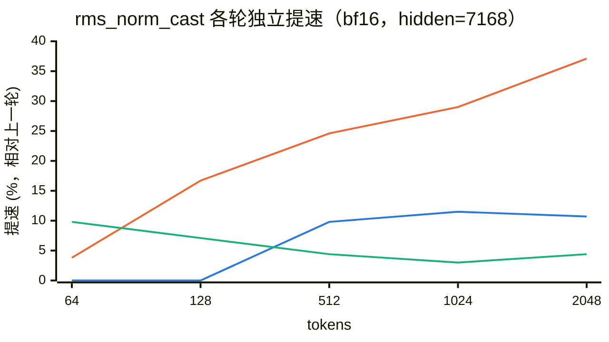
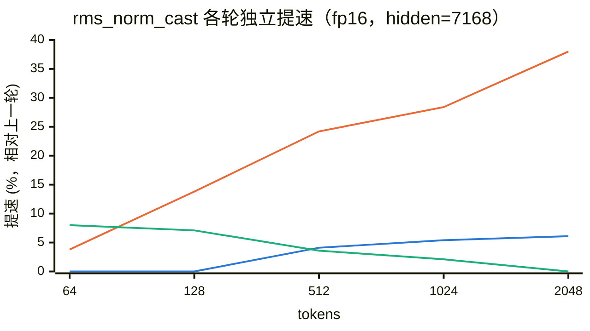
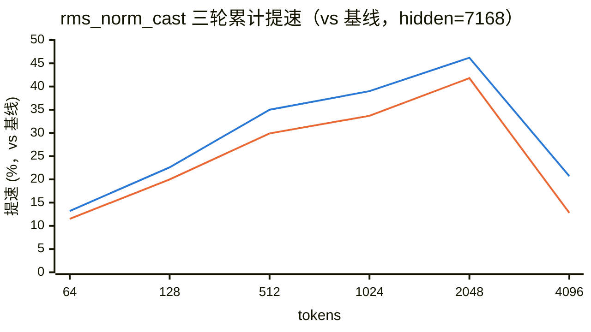
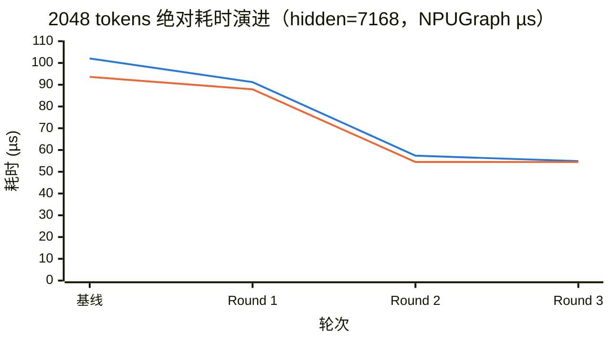

# rms_norm_cast 算子优化实践与性能分析（Ascend 910B）

## 1. 算子功能与优化动机

**功能定位**：`torch.ops._C_ascend.npu_rms_norm_cast` 是面向 MoE 路由场景设计的融合算子，通过一次 kernel 调用同时生成两份输出：

- 低精度 `y`（bf16/fp16）：RMSNorm 结果
- 宽化 `y_fp32`（fp32）：**已舍入 y 的精确宽化**

**计算语义**：对输入的每一行执行以下计算，其中 `n` 表示 hidden size：

```text
rstd   = 1 / sqrt( mean(x²) + ε )          # 倒均方根，mean(x²) 在 fp32 域累加
y      = RoundToDtype( x · rstd · gamma )  # 逐元素，舍入到 x 的低精度 dtype（RINT）
y_fp32 = WidenToFp32( y )                  # 精确宽化，逐位等于 y.float()
```

**接口定义**：

| 方向 | 参数 | dtype / shape | 约束 |
|---|---|---|---|
| 输入 | `x` | bf16 或 fp16，rank ≥ 1，最后一维 = n | 非空 |
| 输入 | `gamma` | 与 `x` 同 dtype，1 维，长度 = n | 逐行共享的缩放权重 |
| 属性 | `epsilon` | float，默认 1e-6 | 非负 |
| 输出 | `y` | 与 `x` 同 dtype、同 shape | RMSNorm 结果 |
| 输出 | `y_fp32` | fp32，同 `x` 的 shape | 契约：`y_fp32 == y.float()` 逐位相等 |

**设计动机**：DeepSeek v4/v41 的 MoE 路由模块（HashTopK）需要同时消费低精度 RMSNorm 结果及其 fp32 宽化结果。非融合实现需要串联 `torch_npu.npu_rms_norm` 与 `y.float()`，并额外完成一次 `y` 的写回和读取，数据搬运量约增加 20%。因此，将两段计算合并到同一 kernel，理论上可以通过减少访存获得稳定收益。

**数值契约**：`y_fp32` 必须是**先舍入到低精度、再宽化到 fp32**的结果，即 `y_fp32 == y.float()` 逐位相等。该约束确保 HashTopK 在融合与非融合路径上获得完全一致的输入，也意味着输出侧的两次 Cast（RINT + widen）不能合并。

**基线问题**：当 tokens ≥ 512 时，融合实现反而慢于非融合实现；以 2048×7168 bf16 为例，耗时为 102.1µs，对比非融合路径的 77.4µs。融合后数据搬运量减少约 20%，性能却出现回退，表明瓶颈不在总访存量，而在 kernel 内部的计算与流水组织。本次优化的目标是定位并消除这部分结构性开销。

## 2. 优化环境与测量口径

| 项 | 值 |
|---|---|
| 硬件 | Ascend 910B3（dav_c220 向量核，40 AIV/Device，UB 192KB/核） |
| CANN | 9.1.0，驱动 npu-smi 25.5.1 |
| 被测 shape | hidden=7168，tokens 1–4096 |
| 记分板口径 | NPUGraph replay |
| pipe 归因口径 | `msprof op --aic-metrics=PipeUtilization` |
| 精度门槛 | 全套精度用例 33 项（见 §9） |

**基线性能特征（2048×7168 bf16）**：kernel 耗时 103.0µs，其中 vec 管线占 65.6%，是当前主要瓶颈；每行需要执行 11 次 vec pass，且行间按照 MTE2→V→MTE3 完全串行，导致 vec 管线累计空转约 31µs。

## 3. 优化总览

| 轮次 | 核心思路 | 2048 bf16 耗时 | 累计提速（vs 基线） |
|---|---|---|---|
| 基线 | — | 102.1µs | — |
| Round 1 | 减 2 遍冗余 vec pass | 91.2µs | 10.7% |
| Round 2 | 行间双缓冲流水 + rstd 向量广播 | 57.4µs | 43.8% |
| Round 3 | 序言去关键路径 + 常量外提 | 约 54.9µs | **46.2%** |

每轮优化均独立提交并单独验证。完整精度用例全程 33/33 通过，结果与基线保持位级一致；rstd 计算路径未发生变化，优化仅消除冗余计算与串行等待。

## 4. Round 1：消除两次冗余 vec pass

**瓶颈分析**：基线 bf16 路径每行执行 11 次 vec pass，其中两次不承担不可替代的计算语义：

1. reduce 之前的全向量 `Muls(work, 1/N, num_col)`。均值缩放可以移动到 reduce 之后，仅对单个标量执行，数学上满足 `sum(x²)/N == sum(x²)·(1/N)`；
2. bf16 路径按行重复执行 `Cast(gamma→fp32)`。由于 gamma 在单核处理范围内保持不变，可以将转换提升到每核初始化阶段。

**优化方法**：

- inv 折叠：删除全向量 Muls，reduce 后对 1 元素做 `Muls(work, work, inv, 1)`；
- gamma 预转换：新增 `gamma_fp32_buf_`，每核仅执行一次 Cast，行循环直接复用；tiling `BYTES_PER_COLUMN` 从 12 调整为 16B/col，并同步更新 UB 预算。

**性能结果**：2048 tokens 下，bf16 耗时由 102.1µs 降至 91.2µs，提升 10.7%；fp16 提升 6.1%。vec busy 由 59.5µs 降至 48.9µs，降幅与消除两次 pass 的预期一致；小 shape 未出现性能回退，精度用例 8/8 通过。

**阶段结论**：vec 占比仍为 61%，且绝对空转时间扩大到约 31µs。计算冗余消除后，行间串行成为新的主要瓶颈，也是下一轮优化的重点。

## 5. Round 2：行间双缓冲流水 + rstd 向量广播（核心轮）

**瓶颈分析**：Round 1 完成后，profile 显示主要瓶颈已由 vec 计算量转移为行间串行：

- 每行 MTE2(载入)→V(计算)→MTE3(落盘) 完全串行，vec 等搬运；
- 每行都通过一次 V_S/GetValue/S_V 标量往返获取 rstd。这是当前**唯一会阻塞发射线程的等待**：wait 挂在标量 pipe 上，导致每行都产生停顿。

**优化方法**：

- **乒乓流水**：为 `x[2]` / `x_fp32[2]` 配置双槽。在处理第 i 行期间，由 MTE2 预取第 i+1 行，并由 MTE3 异步写回第 i 行；`y` 复用 `x` 槽，使 MTE3 不进入 V 的关键路径。事件同步统一采用四件套，MTE3_V 方向因跨两行消费而持有双 ID；
- **rstd 向量广播**：通过 `Gather` 将 `work[0]` 复制为 8 份（32B 块），再使用 `src1BlkStride=0, src1RepStride=0` 的 `Mul` 完成块广播，从而消除标量往返。rstd 全程保留在 UB 中，数值与 Muls 标量路径保持**位级一致**，发射线程不再产生中途停等；
- tiling 按 dtype 分档（bf16 22 / fp16 18 B/col），y 复用 x 槽比原方案再省 2B/col。

**实现风险与修复**：优化过程中定位并修复了三个典型问题：序言阶段槽位奇偶错位导致 NaN、连续调用 FetchEventID 获得同一 ID 导致死锁，以及**退出标志未清零而污染同核后续 kernel**。最终通过保证每个 SetFlag 的发射条件与消费条件严格一致（`i+2 < local_rows`），并在退出前清理悬挂标志，消除上述风险。

**性能结果**：2048 tokens 下，bf16 耗时由 **91.2µs 降至 57.4µs，提升 37.1%**，fp16 提升 38.0%；512–1024 tokens 区间提升 24%–29%。vec 占比由 61% 提升至 91%，MTE2/MTE3 的忙碌时间基本不变，但已大部分移出关键路径；msprof task 耗时由 103µs 降至 53.7µs。精度用例 8/8 通过。

**流水前后的 pipe 级对比**（2048×7168 bf16，单核实测）：判断流水是否生效，最直观的指标是**并行度 = 三条 pipe 忙碌时间之和 ÷ 墙钟时间**。完全串行时该值接近 1.0，出现有效重叠后则大于 1.0。

| 指标 | Round 1（流水前） | Round 2（流水后） |
|---|---|---|
| 墙钟时长 | 80.1µs | 51.3µs |
| vec（计算）忙碌 | 48.9µs（61.0%） | 46.7µs（90.9%） |
| MTE2（载入）忙碌 | 9.9µs（12.4%） | 20.5µs（39.9%） |
| MTE3（落盘）忙碌 | 17.3µs（21.6%） | 17.4µs（33.8%） |
| **三线忙碌之和 / 并行度** | 76.1µs / **0.95** | 84.6µs / **1.65** |

数据表明，vec 计算量基本不变（46.7µs 与 48.9µs 接近，说明算法计算量未改变），但墙钟时间由 80.1µs 降至 51.3µs，收益主要来自串行等待的消除。三条 pipe 的忙碌时间之和由接近墙钟时间（并行度 0.95）提升至墙钟时间的 1.65 倍，说明载入、计算与写回已实现大部分重叠。MTE2 忙碌时间上升是引入流水后的预期特征：其开始承担跨 pipe 的 wait/set flag 同步指令，但占比 40% 仍显著低于 vec 的 91%，因此不在关键路径上。

> 数据口径说明：Round 1 使用 torch_npu.profiler，Round 2 使用 msprof op PipeUtilization 的 40 核均值，两组数据分别在各自口径内保持一致。墙钟时间另通过 NPUGraph 统一口径复核，结果为 91.2µs→57.4µs，提升 37.1%。

## 6. Round 3：序言去关键路径 + 常量外提

**瓶颈分析**：c220 不支持点积类 reduce，仅提供 Sum/Max，因此平方与求和两次 pass 无法继续融合。此时 **pass 数量已达到算法层面的下限**：bf16 路径的 7 次全宽 pass 均承担必要计算语义。剩余优化空间主要集中在启动斜坡和逐行固定开销。

**优化方法**：

- 优先向 MTE2 发射 `x` 第 0 行的载入，再发射 gamma 载入；将 gamma 的等待以及 bf16 宽化 Cast 延迟到第 0 行首次执行 gamma 乘法之前，使装载阶段隐藏在第 0 行 reduce 之后。该调整每核可减少约 0.15µs 的启动串行时间，在每核处理行数较少的 shape 上收益更明显；
- 行不变常量 1.0f 外提到每核一次（原每行 `Duplicate`），每行省 1 op + 1 barrier。

**性能结果**：64–1024 tokens 区间稳定提升 **4%–8%**，例如 bf16 128 tokens 由 8.83µs 降至 8.20µs；2048 tokens 及以上基本持平（msprof 54.0µs，vec 占比 90.3%）。数值保持位级一致，精度用例 8/8 通过。

**小 shape 分析（msprof@1 token）**：scalar 为 1.77µs（44%），显著高于 vec 的 1.05µs（26%），说明 1–16 tokens 属于**发射（issue）瓶颈**。流水机制增加的指令数会在 1–4 tokens 区间带来约 0.3µs 的结构性开销；Round 1 虽然指令更少，但存在标量停等，两种实现各有取舍。

## 7. 性能收益可视化

> 测量口径：NPUGraph replay，hidden=7168。提速率 =（上一轮耗时 − 本轮耗时）/ 上一轮耗时 × 100%，正值表示性能提升。分轮折线图覆盖 64–2048 tokens，即收益稳定为正的吞吐区间；1–16 tokens 属于 decode 场景，存在 ±4% 的结构性权衡（见 §6），4096 tokens 则主要受背靠背执行的系统效应影响，测量噪声约为 ±3%，因此不纳入分轮折线图。完整数据见 §8。

### 7.1 各轮独立收益 — bf16

| tokens | R1 vs 基线 | R2 vs R1 | R3 vs R2 |
|---|---|---|---|
| 64 | 0.0% | 3.8% | 9.8% |
| 128 | 0.0% | 16.7% | 7.1% |
| 512 | 9.8% | 24.6% | 4.4% |
| 1024 | 11.5% | 29.0% | 3.0% |
| 2048 | 10.7% | 37.1% | 4.4% |



### 7.2 各轮独立收益 — fp16

| tokens | R1 vs 基线 | R2 vs R1 | R3 vs R2 |
|---|---|---|---|
| 64 | 0.0% | 3.8% | 8.0% |
| 128 | 0.0% | 13.8% | 7.1% |
| 512 | 4.1% | 24.2% | 3.6% |
| 1024 | 5.4% | 28.4% | 2.1% |
| 2048 | 6.1% | 38.0% | 0.0% |



### 7.3 最终累计收益（vs 基线，64–4096）

| tokens | bf16 | fp16 |
|---|---|---|
| 64 | 13.2% | 11.5% |
| 128 | 22.6% | 20.0% |
| 512 | 35.0% | 29.9% |
| 1024 | 39.0% | 33.7% |
| 2048 | 46.2% | 41.8% |
| 4096 | 20.7% | 12.8% |



### 7.4 关键 shape 绝对耗时演进（2048 tokens）

| 轮次 | bf16 (µs) | fp16 (µs) |
|---|---|---|
| 基线 | 102.07 | 93.61 |
| Round 1 | 91.2 | 87.9 |
| Round 2 | 57.4 | 54.5 |
| Round 3 | 54.88 | 54.48 |



## 8. 最终记分板（NPUGraph，µs/次，hidden=7168）

| tokens | bf16 基线→终值 | 提速 | fp16 基线→终值 | 提速 |
|---|---|---|---|---|
| 1 | 2.91→3.03 | -4% | 2.80→2.85 | -2% |
| 4 | 3.06→3.18 | -4% | 2.90→3.01 | -4% |
| 16 | 3.82→3.82 | 0% | 3.69→3.69 | 0% |
| 64 | 7.11→6.17 | **13%** | 6.80→6.02 | **12%** |
| 128 | 10.60→8.20 | **23%** | 9.92→7.94 | **20%** |
| 512 | 25.72→16.73 | **35%** | 23.25→16.29 | **30%** |
| 1024 | 47.56→28.99 | **39%** | 42.39→28.10 | **34%** |
| 2048 | 102.07→54.88 | **46%** | 93.61→54.48 | **42%** |
| 4096 | 222.39→176.36 | **21%** | 209.27→182.43 | **13%** |

> 提速为正表示性能提升。1–4 tokens 回退 0.1–0.3µs，属于发射瓶颈下的结构性权衡，详见 §6。

**与非融合实现对比**（`npu_rms_norm + .float()`）：2048 tokens bf16 提升 **29%**，4096 tokens 提升 11%。

**kernel 内部表现**（msprof 孤立口径）：2048 tokens bf16 由 103.0µs 降至 54.0µs，vec 占比由 65.6% 提升至 90.3%；4096 tokens 的孤立执行时长约为 2048 tokens 的 2 倍，符合线性扩展特征。

## 9. 精度保障

- 精度用例覆盖 dtype × token 规模、行流水边界（单核 1/2/3 行、混合行数核、空闲核）、hidden 尾部与非对齐场景、高 rank 输入、epsilon 边界、输入极值（全零/×100）、**同进程连续调用 + 交叉算子**（用于验证退出标志清零契约），以及非法输入拒绝路径（超大 hidden、负 epsilon、dtype 不匹配）；
- 全程 **33/33 通过**。三轮优化均保持数值路径位级一致；rstd 计算不变，仅消除冗余与串行，并对每个用例断言 `y_fp32 == y.float()`。

## 10. 可复用沉淀

1. **事件四件套**：手工事件编排统一使用 `AllocEventID/SetFlag/WaitFlag/ReleaseEventID`。FetchEventID 只读取但不占用 ID，连续调用可能获得同一 ID；
2. **退出标志清零契约**：kernel 退出前，每个 SetFlag 都必须由对应的 WaitFlag 消费，否则可能污染同核执行的下一个 kernel，典型表现是“下一个算子挂死”。更稳妥的实现方式是让标志的发射条件与消费条件严格一致；
3. **跨 pipe 等待机制**：一般情况下，跨 pipe 的 wait 挂在目标 pipe 上，不阻塞发射线程；V_S 是例外。需要使用标量时，应优先考虑通过 Gather 或 stride-0 广播将数据保留在向量域；
4. **性能测量口径**：NPUGraph replay 更接近背靠背 serving，大 shape 会受到前一 kernel 写出排空的影响；msprof 更接近 kernel 的孤立峰值。对比大 shape 性能时必须明确测量口径；
5. **小 shape 优化策略**：通过 msprof 的 scalar/vec 占比可以快速判断瓶颈属于 issue-bound 还是 compute-bound，两类瓶颈需要采用不同的优化手段。
